=## 实验1：启动PC
>*截止日期为2018年9月13日*

### 简介

本实验分为三个部分。第一部分专注于熟悉x86汇编语言，QEMU x86模拟器以及PC的开机自举程序。第二部分检查我们的6.828内核的引导加载程序，它位于`lab`目录下的`boot`目录中。最后，第三部分深入研究名为JOS的6.828内核本身的初始模板，它位于`kernel`目录中。

### 软件设置

本课程中此实验作业和后续实验作业所需的文件将使用Git 版本控制系统进行分发。要了解有关Git的更多信息，请查看  [ Git user's manual ](https://mirrors.edge.kernel.org/pub/software/scm/git/docs/user-manual.html)，或者，如果您已熟悉其他版本控制系统，那么这本[ CS-oriented overview of Git ](https://eagain.net/articles/git-for-computer-scientists/)可能会有用。

这个课程Git存储库的URL是 <https://pdos.csail.mit.edu/6.828/2018/jos.git> 。要在Athena帐户中安装文件，您需要通过运行以下命令来克隆课程存储库。你必须使用基于x86架构的Athena机器; 也就是说，执行`uname -a`应该出现i386 GNU / Linux或i686 GNU / Linux或 x86_64 GNU / Linux。您可以使用`ssh -X athena.dialup.mit.edu`登录公共Athena主机。

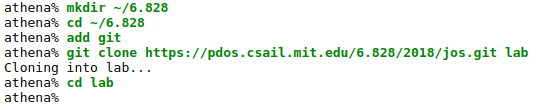

您可以使用Git查看您对代码的改动。例如，如果您已完成其中一个练习，并想要检查您的进度，则可以通过运行以下命令提交更改：

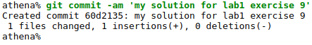 

您可以使用 `git diff` 命令跟踪更改。运行git diff将显示自上次提交后代码的更改，`git diff origin/lab1`并将显示相对于为本实验提供的初始代码的更改。这里，origin / lab1是git分支的名称，其中包含从我们的服务器下载的用于此作业的初始代码。

我们在Athena为您设置了适当的编译器和模拟器。要使用它们，请运行`add -f 6.828`。每次登录时都必须运行此命令（或将其添加到 〜/ .environment文件中）。如果在编译或运行qemu时遇到未知错误，请仔细检查是否添加了课程锁定器。

如果您正在使用非Athena机器，则需要按照[ 工具页面 ](https://pdos.csail.mit.edu/6.828/2018/tools.html)上的说明安装 qemu和gcc。我们已经对qemu进行了一些有用的调试更改，一些后来的实验依赖于这些补丁，因此您必须构建自己的补丁。如果你的机器采用的是原生ELF工具链（如Linux和BSD最多的，但值得注意的是不是 OS X），你可以简单地使用你的包管理器安装 GCC。否则，请按照工具页面上的说明进行操作。

### 交作业流程

您将使用[ 这个网站 ](https://6828.scripts.mit.edu/2018/handin.py/)上交作业。您需要先从网站申请API密钥，然后才能上交任何作业或实验。

实验代码附带GNU Make规则，使提交更容易。完成实验后，输入`make handin`提交实验代码。

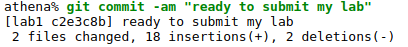

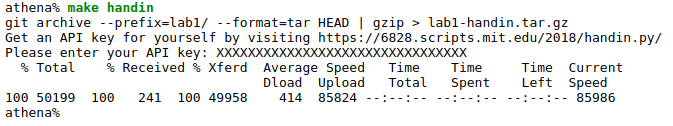

`make handin`将您的API密钥存储在myapi.key中。如果您需要更改API密钥，只需删除此文件并make handin 再次生成（myapi.key不能包含换行符）。
如果使用`make handin`并且您有未经修改的更改或未跟踪的文件，您将看到类似于以下内容的输出：

```
 M hello.c
?? bar.c
?? foo.pyc
Untracked files will not be handed in. Continue？[Y / N]
```

检查上述行并确保有跟踪实验解决方案所需的所有文件，即未列在以`??`为开头的行中。

在这种情况下`make handin`不能正常工作，请尝试使用`curl`或`Git`命令解决了这个问题。或者你可以运行`make tarball`。这将为您创建一个tar文件，然后您可以通过我们的[ Web网站 ](https://6828.scripts.mit.edu/2018/handin.py/)上传 。

您可以使用`make grade`来运行评分程序以测试您的解决方案。该[ web interface ](https://6828.scripts.mit.edu/2018/handin.py/)使用相同的分级方案来评定您的实验的档次。您应该查看评分程序的评分（定期运行的评分程序可能需要几分钟）并确保您收到了预期的等级。如果成绩不匹配，您的实验室提交可能有错误 - 检查评分程序的结果（resp-lab * .txt）以查看哪个特定测试有失败。

对于实验1，您无需回答下面的任何问题。（尽管你们可以回答！并且这样将会有利于余下的实验。）

### 第1部分：PC Bootstrap

第一个练习的目的是向您介绍x86汇编语言和PC引导程序，以及QEMU和QEMU / GDB调试的入门。您不必为实验的这一部分编写任何代码，但无论如何您都应该通过它来进行自己的理解，并准备好回答下面提出的问题。

#### x86汇编入门

如果您还不熟悉x86汇编语言，那么在本课程中您将很快熟悉它！[PC Assembly Language Book](https://pdos.csail.mit.edu/6.828/2018/readings/pcasm-book.pdf)这本书就是一个很好的入门书。希望对你来说这是一本经典和现代知识相结合的书。

注意：不幸的是，本书中的示例是为NASM汇编程序编写的，而我们将使用GNU汇编程序。NASM使用的是Intel语法，而GNU使用AT＆T语法。虽然在语义上是等效的，但是程序文件会有很大不同，至少表面上看，这取决于使用的语法。幸运的是，两者之间的转换非常简单，并且在[ Brennan's Guide to Inline Assembly ](http://www.delorie.com/djgpp/doc/brennan/brennan_att_inline_djgpp.html)中有所介绍。

<table><tr><td>
练习1. 熟悉6.828参考页面上提供的汇编语言材料 。现在不必阅读它们，但在阅读和编写x86汇编程序时，肯定会要参考这些材料。

我们建议您阅读[ Brennan's Guide to Inline Assembly ](http://www.delorie.com/djgpp/doc/brennan/brennan_att_inline_djgpp.html)中的 “The Syntax”部分 。它有很好的描述（并且非常简短）在JOS中的GNU汇编程序使用的AT＆T汇编语法。
</td></tr></table>

当然，x86汇编语言编程的权威参考是英特尔的指令集架构参考，您可以在6.828参考页面上找到两种版本：旧版[  80386 Programmer's Reference Manual ](https://pdos.csail.mit.edu/6.828/2018/readings/i386/toc.htm)，比起最新版它要更简单，更易于查找，而且描述了我们将在6.828中使用的所有x86处理器功能; 以及来自英特尔的完整，最新和最好的 IA-32英特尔架构软件开发人员手册，涵盖了我们在课堂上不需要的最新处理器的所有功能，但您可能有兴趣了解这些功能。AMD提供了同样的一套（通常更友好）手册 。保存Intel / AMD体系结构手册以供日后使用，或者在您想要查找特定处理器功能或指令的具体的解释时将其用作参考。

#### 模拟x86

我们不是在真实的个人计算机（PC）上开发操作系统，而是使用一个忠于模拟完整PC的程序：您为仿真器编写的代码也可以在真正的PC上启动。使用仿真器简化了调试; 例如，您可以在模拟x86内部设置断点，这对于x86的`silicon`版本很难实现。

在6.828中，我们将使用 `QEMU Emulator`，这是一个现代化的且相对快速的模拟器。虽然QEMU的内置监视器仅提供有限的调试支持，但QEMU可以作为GNU调试器（GDB）的远程调试目标 ，我们将在本实验中使用它来逐步完成早期启动过程。

首先，如上面“软件设置”中所述，将Lab 1文件解压缩到您自己的Athena上的目录中，然后在lab目录中键入make（或gmake在BSD系统上）以构建最初的6.828引导加载程序和内核。（将我们在这里运行的代码称为“内核”有点慷慨，但我们会在整个学期内充实它。）

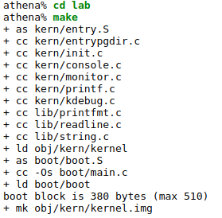

（如果你得到“undefined reference to `__udivdi3`”之类的错误，你可能没有32位gcc multilib。如果你正在使用Debian或Ubuntu，请尝试安装gcc-multilib包。）

现在您已准备好运行QEMU，将上面创建的文件obj / kern / kernel.img作为模拟PC“虚拟硬盘”的内容。此硬盘映像包含我们的引导加载程序（obj / boot / boot）和我们的内核（obj / kernel）。


这将执行QEMU，其中包含将硬盘和直接串行端口输出设置到终端所需的选项。某些文本应出现在QEMU窗口中：


“ Booting from Hard Disk... ” 之后的所有内容都是由我们的JOS内核打印出来的; 这个`K>`是一个在内核中的打印提示监视符，或交互式控制程序。如果你使用` make qemu`，内核打印的这些行将出现在运行QEMU的shell窗口和QEMU显示窗口中。这是因为为了测试和实验室评分的目的，我们设置了JOS内核，不仅将其控制台输出写入虚拟VGA显示器（如QEMU窗口中所示），还将其写入模拟PC的虚拟串行端口，QEMU位于将输出转换为自己的标准输出。同样，JOS内核将从键盘和串行端口获取输入，因此您可以在VGA显示窗口或运行QEMU的终端中输入命令。或者，您可以通过运行使用不带虚拟VGA的串行控制台`make qemu-nox`。如果您通过SSH连接到Athena，这会很方便。要退出qemu，请键入`Ctrl+a x`。

您只能向内核监视器输入`help`和`kerninfo`这两个命令 。

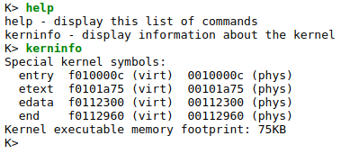

这个`help`命令是显而易见的，并且我们很快就要讨论`kerninfo`命令打印的东西是什么意思。虽然很简单，但重要的是它表示这个内核监视器“直接”在模拟PC的“原始（虚拟）硬件”上运行。这意味着您应该能够将`obj / kern / kernel.img`的内容复制 到真实硬盘的前几个扇区，将该硬盘插入真正的PC，打开它，然后看到完全相同的东西。正如您在QEMU窗口中所做的那样，PC的真实屏幕。（我们不建议您在真正的计算机上使用其硬盘上的有用信息执行此操作，因为复制kernel.img 到其硬盘的开头将会丢弃主引导记录和第一个分区的开头，并且直接地导致以前在硬盘上的所有内容丢失！）

#### PC的物理地址空间

我们现在将深入探讨有关PC如何启动的更多细节。PC的物理地址空间是硬连线的，具有以下总体布局：

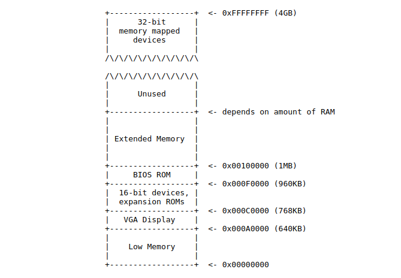

第一代基于16位Intel 8088处理器的PC仅能够使用1MB的物理内存。因此，早期PC的物理地址空间将从0x00000000开始，但以0x000FFFFF结束，而不是0xFFFFFFFF。标有“Low Memory”的640KB区域是早期PC可以使用的唯一随机存取存储器（RAM）; 事实上，最早的PC只能配置16KB，32KB或64KB的RAM！

从0x000A0000到0x000FFFFF的384KB区域由硬件保留用于特殊用途，例如视频显示缓冲区和非易失性存储器中保存的固件。此保留区域最重要的部分是基本输入/输出系统（BIOS），它占用从0x000F0000到0x000FFFFF的64KB区域。在早期的PC中，BIOS保存在真正的只读存储器（ROM）中，但是当前的PC将BIOS存储在可更新的闪存中。BIOS负责执行基本系统初始化，例如激活视频卡和检查安装的内存容量。执行此初始化后，BIOS从某些适当的位置（如软盘，硬盘，CD-ROM或网络）加载操作系统，并将机器的控制权交给操作系统。

最后在英特尔发明的分别支持16MB和4GB物理地址空间的80286和80386处理器”打破了“1兆字障”时，PC架构师仍保留了原有的低1MB物理地址空间布局，以确保向后兼容现有软件。因此，现代PC在物理内存中有一个“漏洞”，从0x000A0000到0x00100000，将RAM分为“低”或“常规内存”（开始的640KB）和“扩展内存”（其他所有剩余容量）。此外，PC的32位物理地址空间顶部的一些空间，尤其是物理RAM，现在通常由BIOS保留，供32位PCI设备使用。

最近x86处理器可以支持超过4GB的物理内存，所以RAM可以在0xFFFFFFFF的基础上进一步延伸。在这种情况下，BIOS必须安排在32位可寻址区域顶部的系统RAM中留下第二个区域，为这些32位设备留出空间。由于设计限制，JOS将只使用PC的物理内存的开头256MB，所以现在我们将假装所有PC“仅”拥有32位物理地址空间。但是处理复杂的物理地址空间和多年来发展的硬件组织的其他方面是OS开发的重要实际挑战之一。

#### ROM BIOS

在本部分实验中，您将使用QEMU的调试工具来研究IA-32兼容计算机的启动方式。

打开两个终端窗口并且使用`cd`进入到lab目录中。在一个终端中，输入`make qemu-gdb`（或`make qemu-nox-gdb`）。这将启动QEMU，但QEMU在处理器执行第一条指令之前停止，并等待来自GDB的调试连接。在第二个终端的同一目录开始中，运行`make`和`make gdb`。你应该看到这样的东西，

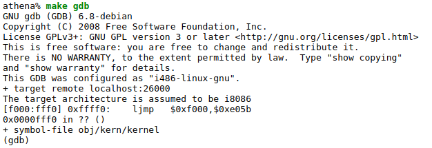

我们提供了一个.gdbinit文件，用于设置GDB以调试早期启动期间使用的16位的代码，使其侦听QEMU。（如果它不工作，你可能需要添加一个`add-auto-load-safe-path`到你的`home`目录下的`.gdbinit`文件中，引导GDB处理我们提供的`.gdbinit`。 GDB会告诉你是否要做这个。）

以下行：

`[f000：fff0] 0xffff0：ljmp $ 0xf000，$ 0xe05b`

是GDB对要执行的第一条指令的反汇编。从这个输出中你可以得出以下结论：

+ IBM PC开始在物理地址0x000ffff0处执行，该地址位于为ROM BIOS保留的64KB区域的最顶端。
+ PC开始执行CS = 0xf000和IP = 0xfff0。
+ 要执行的第一条指令是jmp指令，它跳转到分段地址为 CS = 0xf000和IP = 0xe05b。

为什么QEMU会这样开始？这就是英特尔如何设计在IBM的原始PC中使用的8088处理器。由于PC中的BIOS与物理地址范围0x000f0000-0x000fffff“硬连线”，因此该设计可确保BIOS在任何系统启动或重启后始终第一个控制机器 - 这对于电源而言至关重要 - 在机器的RAM的任何地方，没有该处理器可以执行的其他的软件。QEMU模拟器带有自己的BIOS，它放置在处理器的模拟物理地址空间中。在处理器复位时，（模拟）处理器进入实模式并将CS设置为0xf000，将IP设置为0xfff0，以便从该（CS：IP）段地址开始执行。分段地址0xf000:fff0是如何转换成物理地址呢？

要回答这个问题，我们需要了解一下实模式寻址。在实模式（PC启动的模式）中，地址转换根据以下公式： 物理地址 = 16 * 段 + 偏移。因此，当PC将CS设置为0xf000且IP设置为0xfff0时，引用的物理地址为：

```
   16×0xf000 + 0xfff0＃十六进制乘以16是
   = 0xf0000 + 0xfff0＃easy  - 只需追加0。
   = 0xffff0 
```

0xffff0是BIOS结束前的16个字节（0x100000）。因此，我们不应该感到惊讶的是，BIOS所做的第一件事是jmp跳回到BIOS的前面的位置; 毕竟只有16个字节，能完成多少？

<table><tr><td>

练习2. 使用GDB的 `si`（步骤指令）命令跟踪ROM BIOS以获取更多指令，并尝试猜测它可能正在做什么。您可能需要查看[ Phil Storrs I/O Ports Description](http://web.archive.org/web/20040404164813/members.iweb.net.au/~pstorr/pcbook/book2/book2.htm)以及[ 6.828 reference materials page](https://pdos.csail.mit.edu/6.828/2018/reference.html) 。无需弄清楚所有细节 - 只是首先了解BIOS的主要内容。
</td></tr></table>

当BIOS运行时，它会设置一个中断描述符表并初始化各种设备，如VGA显示器。这是您在QEMU窗口中看到的“ Starting SeaBIOS ”消息的来源。

初始化PCI总线和BIOS知道的所有重要设备后，它会搜索可引导设备，如软盘，硬盘驱动器或CD-ROM。最终，当它找到可引导磁盘时，BIOS 从磁盘读取引导加载程序并将控制权转移给它。

### 第2部分：引导加载程序

PC的软盘和硬盘分为512个字节区域，称为扇区。扇区是磁盘的最小传输粒度：每个读取或写入操作必须是一个或多个扇区，并在扇区边界上对齐。如果磁盘是可引导的，则第一个扇区称为引导扇区，因为这是引导加载程序代码所在的位置。当BIOS找到可引导的软盘或硬盘时，它将512字节的引导扇区加载到物理地址0x7c00和0x7dff之间的内存中，然后使用jmp指令将CS：IP设置为0000：7c00，将控制权传递给引导加载程序。与BIOS加载地址一样，这些地址相当随意 - 但它们是针对PC修复和标准化的。

在PC的发展过程中，从CD-ROM启动的能力的出现要晚得多，因此PC架构师借此机会稍微重新考虑了一下启动过程。因此，现代BIOS从CD-ROM引导的方式有点复杂（而且功能更强大）。CD-ROM使用的扇区大小为2048字节而不是512，并且BIOS可以在将控制转移到内存之前将更大的引导映像从磁盘加载到内存（而不仅仅是一个扇区）。有关详细信息，请参阅["El Torito" Bootable CD-ROM Format Specification](https://pdos.csail.mit.edu/6.828/2018/readings/boot-cdrom.pdf)。

但是，对于6.828，我们将使用传统的硬盘启动机制，这意味着我们的启动加载程序必须适合512字节。引导加载程序包含一个汇编语言源文件`boot / boot.S`和一个C源文件`boot / main.c` 仔细查看这些源文件，确保您了解正在进行的事情。引导加载程序必须执行两个主要功能：

1. 首先，引导加载程序将处理器从实模式切换到32位保护模式，因为只有在此模式下，软件才能访问处理器物理地址空间中1MB以上的所有内存。保护模式在[ PC Assembly Language](https://pdos.csail.mit.edu/6.828/2018/readings/pcasm-book.pdf)的 1.2.7和1.2.8节中有简单介绍，并且在英特尔架构手册中有详细介绍。此时，您只需要了解将分段地址（段：偏移对）转换为物理地址在保护模式下的转换方式不同，并且在转换偏移之后转换为32位而不是16位。
2. 其次，引导加载程序通过x86的特殊I/O指令直接访问IDE磁盘设备寄存器，从硬盘读取内核。如果您想更好地了解这里的特定I/O指令，请查看[ the 6.828 reference page](https://pdos.csail.mit.edu/6.828/2018/reference.html)上的 “IDE hard drive controller”部分。您不需要了解有关在此类中编程特定设备的知识：实际上,编写设备驱动程序是操作系统开发的一个非常重要的部分，但从概念或架构的角度来看，它也是最乏味的部分之一。

在了解了引导加载程序源代码之后，请查看文件`obj/boot/boot.asm`。这个文件是在编译引导加载程序后，我们的`GNUmakefile `创建的一个引导加载程序的反汇编文件。这个反汇编文件可以很容易地查看所有引导加载程序代码所在的物理内存的确切位置，并且在GDB中单步执行引导加载程序时，可以轻松地跟踪发生的情况。同样，`obj/kern/kernel.asm`包含一个JOS内核的反汇编文件，它通常被用于调试。

您可以使用`b `命令在GDB中设置地址断点。例如，b \*0x7c00在地址0x7C00处设置断点。在断点处，可以使用`c`与 `si`命令继续执行：c使QEMU继续执行，直到下一个断点（或者在GDB中，直至按下 Ctrl-C）。 si N指令，可以设置一次执行N步。

要检查内存中的指令（除了要执行下一个指令之外，GDB会自动打印信息），您可以使用`x/i`命令。此命令具有` x/Ni ADDR`这样的语法，其中N是要反汇编的连续指令的数量，ADDR是开始反汇编的内存地址。

<table><tr><td>

练习3. 查看[ lab tools guide](https://pdos.csail.mit.edu/6.828/2018/labguide.html)，尤其是关于GDB命令的部分。即使您熟悉GDB，但是它也包括一些对OS工作有用的深奥GDB命令。

在地址0x7c00处设置断点，这是加载引导扇区的位置。继续执行到该断点。通过跟踪代码`boot/boot.S`，使用的源代码和反汇编文件` obj/boot/boot.asm`跟踪你在哪里。还可以使用GDB中的`x/i`命令来反汇编引导加载程序中的指令序列，并将原始引导加载程序源代码与`obj/boot/boot.asm `和GDB中的反汇编代码进行比较。

跟踪到`boot/main.c`中bootmain（）在，然后进入readsect（） 。确定与readsect（）中每个语句对应的精确汇编指令。跟踪readsect（）的其余部分，并返回到bootmain（），并识别for循环的开始和结束，它能从磁盘读取内核的剩余扇区。找出循环结束时将运行的代码，在那里设置断点，并继续执行到该断点。然后逐步执行引导加载程序的其余部分。
</td></tr></table>

能够回答以下问题：

+ 处理器在什么时候开始执行32位代码？从16位模式切换到32位模式究竟改变了什么？
+ 引导加载程序执行的最后一条指令是什么，它刚加载的内核的第一条指令是什么？
+ 内核的第一条指令在哪里？
+ 引导加载程序是怎样决定从磁盘获取整个内核必须读取多少扇区？它在哪里找到这些信息？

#### 加载内核

现在，我们将对`boot/main.c`中的引导加载程序的C语言部分详细介绍。但在此之前，现在是停下来并且回顾一些C编程基础知识的好时机。

<table><tr><td>

练习4. 阅读C语言中的指针编程。C语言的最佳参考书是Brian Kernighan和Dennis Ritchie 编写的*The C Programming Language*（称为“K＆R”）。我们建议学生购买这本书（这里是 [Amazon Link](http://www.amazon.com/C-Programming-Language-2nd/dp/0131103628/sr=8-1/qid=1157812738/ref=pd_bbs_1/104-1502762-1803102?ie=UTF8&s=books)）或寻找[ MIT's 7 copies](http://library.mit.edu/F/AI9Y4SJ2L5ELEE2TAQUAAR44XV5RTTQHE47P9MKP5GQDLR9A8X-10422?func=item-global&doc_library=MIT01&doc_number=000355242&year=&volume=&sub_library=)中的一本书。

通过阅读`K＆R`中5.1（指针和地址）和5.5（字符指针和函数）。然后下载[ pointers.c](https://pdos.csail.mit.edu/6.828/2018/labs/lab1/pointers.c)的代码 ，运行它，并确保您了解所有输出值的来源。特别是，请确保您了解输出行1和6中指针所在的位置，输出行2到4中的所有值是怎样被传送的，以及为什么第5行中打印的值看似已损坏。

关于C中的指针还有其他参考文献（例如，Ted Jensen的一篇教程，其中引用了K＆R），尽管没有强烈推荐。

注意： 除非你已经精通C语言，否则不要跳过甚至略过这个阅读练习。如果你真的不理解C中的指针，你将在后续的实验中遭受无尽的痛苦和痛苦，然后最终以艰难的方式理解它们。相信我们; 你不想知道“艰难的方式”是什么。
</td></tr></table>

要理解`boot/main.c`，你需要知道ELF二进制文件是什么。当您编译和链接像JOS内核的C程序时，编译器将每个C源（' .c '）文件转换为`object`（' .o '）文件，该文件包含以硬件所需的二进制格式编码的汇编语言指令。 。然后，链接器将所有编译的目标文件组合成单个二进制映像，例如`obj/kern/kernel`，在这种情况下，它是ELF格式的二进制文件，代表“可执行和可链接格式”。

有关此格式的完整信息，请参阅[ our reference page](https://pdos.csail.mit.edu/6.828/2018/readings/elf.pdf)上的[ the ELF specification](https://pdos.csail.mit.edu/6.828/2018/reference.html)，但在这个课程您无需深入研究这个格式的详细信息。虽然整个格式非常强大和复杂，但大多数复杂的部分用于支持动态加载共享库，我们在这个课程中不需要。在维基百科页面有一个简短的介绍。

出于6.828的目的，您可以将ELF可执行文件视为带有加载信息的头，后跟几个程序部分，每个程序部分是一个连续的代码块或数据，用于加载到指定地址的内存中。引导加载程序不会修改代码或数据; 它将其加载到内存中并开始执行它。

ELF二进制文件以固定长度的ELF头开始，后跟可变长度的程序头， 列出要加载的每个程序段。这些ELF头的C定义在inc/elf.h中。我们需要了解的的段是：

+ .text：程序的可执行指令。
+ .rodata：只读数据，例如C编译器生成的ASCII字符串常量。（但是，我们不会费心设置硬件来禁止写入。）
+ .data：数据部分保存程序的初始化数据，例如使用初始化器（如int x = 5）声明的全局变量; 。

当链接器计算程序的内存布局时，它会为未初始化的全局变量保留空间，例如int x; ，在一个名为.bss的段中 ，紧跟在内存中的.data之后。C要求“未初始化”的全局变量以零值开头。因此，不需要 在ELF二进制文件中存储.bss的内容; 相反，链接器只记录.bss部分的地址和大小。加载程序或程序本身必须安排将.bss部分归零 。

通过键入以下内容，检查内核可执行文件中所有部分的名称，大小和链接地址的完整列表：

`athena% objdump -h obj/kern/kernel`

（如果您编译了自己的工具链，则可能需要使用i386-jos-elf-objdump）

您将看到比我们上面列出的更多的部分，但其他部分对我们实验的目的并不重要。其他大多数都是保存调试信息，调试信息通常包含在程序的可执行文件中，但不会被程序加载器加载到内存中。

请特别注意.text段的“VMA”（或链接地址）和“LMA”（或加载地址） 。段的加载地址是应该将该段加载到内存中的内存地址。

段的链接地址是段期望执行的内存地址。链接器以各种方式对二进制文件中的链接地址进行编码，例如当代码需要全局变量的地址时，如果二进制文件在未链接的地址执行，则二进制文件通常不起作用。（可以生成不包含任何此类绝对地址的与位置无关的代码。现代共享库广泛使用它，但它具有性能和复杂性成本，因此我们不会在6.828中使用它。）

通常，链接和加载地址是相同的。例如，查看引导加载程序的.text部分：

`athena% objdump -h obj/boot/boot.out`

引导加载程序使用ELF 程序头来决定如何加载段。程序头指定要加载到内存中的ELF对象的哪些部分以及每个应占用的目标地址。您可以键入以下内容来检查程序头：

`athena% objdump -x obj/kern/kernel`

然后，程序头在objdump的输出中的“Program Headers”下列出。需要加载到内存中的ELF对象的区域是标记为“LOAD”的区域。给出了每个程序头的其他信息，例如虚拟地址（“vaddr”），物理地址（“paddr”）和加载区域的大小（“memsz”和“filesz”）。

回到`boot/main.c`，在每个程序头的`ph->p_pa`字段包含段的目标物理地址（在这种情况下，它实际上是一个物理地址，尽管ELF规范对该字段的实际含义含糊不清）。

BIOS将引导扇区加载到从地址0x7c00开始的内存中，因此这是引导扇区的加载地址。这也是引导扇区执行的地方，因此这也是它的链接地址。我们通过将`-Ttext 0x7C00`传递给`boot/Makefrag`中的链接器来 设置链接地址，因此链接器将在生成的代码中生成正确的内存地址。

<table><tr><td>

练习5. 如果您要使引导加载程序的链接地址出错，请再次跟踪引导加载程序的前几条指令，并确定第一条指令将“中断”或以其他方式执行错误的操作。然后将`boot/Makefrag`中的链接地址更改为错误的，并运行`make clean`，使用`make`重新编译实验，然后再次跟踪引导加载程序以查看发生的情况。不要忘记改回原来的链接地址，并再次运行`make clean`！
</td></tr></table>

回顾一下内核的加载和链接地址。与引导加载程序不同，这两个地址不相同：内核告诉引导加载程序将其加载到低地址（1M字节）的内存中，但它希望从高地址执行。我们将在下一节深入探讨如何使它工作。

除了段信息之外，ELF头中还有一个对我们很重要的字段，名为e_entry。该字段保存程序中入口点的链接地址：程序应该开始执行的程序文本部分中的存储器地址。你可以看到入口点：

`athena% objdump -f obj/kern/kernel`

您现在应该能够理解` boot/main.c`中的最小ELF加载器 。它将内核的每个部分从磁盘读入内存的段加载地址，然后跳转到内核的入口点。

<table><tr><td>

练习6. 我们可以使用GDB的` x`命令检查内存。该[ GDB manual](https://sourceware.org/gdb/current/onlinedocs/gdb/Memory.html)有详细的介绍，但就目前而言，了解` x/Nx ADDR`命令输出内存`ADDR`处的`N`个字就足够了。（请注意，命令中的' x '都是小写的。） 警告：字的大小不是通用标准。在GNU汇编中，一个字是两个字节（xorw中的'w'，代表字，表示2个字节）。

重置机器（退出`QEMU/GDB`并再次启动它们）。在BIOS进入引导加载程序时检查在内存0x00100000处的8个字，然后在引导加载程序进入内核时再次检查。他们为什么不同？第二个断点有什么？（你真的不需要用QEMU来回答这个问题。试想一下。）
</td></tr></table>

### 第3部分：内核

我们现在将开始更详细地研究最小的JOS内核。（最后你会写一些代码！）。与引导加载程序一样，内核从一些汇编语言代码开始，这些代码设置一些东西可以使C语言代码正确执行。

#### 使用虚拟内存来解决位置依赖问题

当您检查上面的引导加载程序的链接和加载地址时，它们完全匹配，但内核的链接地址（由objdump打印）与其加载地址之间存在（相当大）差异。回去检查两者，确保你能看懂我们正在讨论的内容。（链接内核比引导加载程序更复杂，因此链接和加载地址是位于`kern/kernel.ld`的顶部。）

操作系统内核通常喜欢链接并在非常高的虚拟地址（例如0xf0100000）下运行，以便留下处理器虚拟地址空间的下半部分供用户程序使用。在下一个实验室中，这种安排的原因将变得更加清晰。

许多机器在地址0xf0100000处没有任何物理内存，因此我们无法指望能够在那里存储内核。相反，我们将使用处理器的内存管理硬件将虚拟地址0xf0100000（内核代码期望运行的链接地址）映射到物理地址0x00100000（引导加载程序将内核加载到物理内存中）。这样，虽然内核的虚拟地址足够高，可以为用户进程留出足够的地址空间，但它将被加载到PC RAM的1MB的物理内存中，就在BIOS ROM的上方。这种方法要求PC至少有几兆字节的物理内存（因此物理地址0x00100000可以工作），但这可能适用于1990年以后建立的任何PC。

事实上，在下一个实验中，我们将把整个底部256MB的从0x00000000到0x0fffffff的物理地址空间分别映射到虚拟地址0xf0000000到0xffffffff。您现在应该知道了为什么JOS只能使用前256MB的物理内存。

现在，我们只需映射前4MB的物理内存，这足以让我们启动并运行。我们使用`kern/entrypgdir.c`中手写的，静态初始化的页面目录和页表来完成此操作。现在，您不必了解其工作的细节，只需了解其实现的效果。在`kern/entry.S`里面设置了`CR0_PG`标志之后,内存的引用被视为物理地址（严格来说，它们是线性地址，但`boot/boot.S`设置从线性地址到物理地址的身份映射，我们永远不会要改变那个）。一旦`CR0_PG`设置，内存引用由虚拟内存硬件将虚拟地址转换为物理地址。` entry_pgdir`将0xf0000000到0xf0400000范围内的虚拟地址转换为物理地址0x00000000到0x00400000，以及虚拟地址0x00000000到0x00400000同样会被翻译成物理地址0x00000000到0x00400000。由于我们尚未设置中断处理，所以任何不属于这两个范围之一的虚拟地址都会导致硬件异常，将导致QEMU转储机器状态并退出（如果没有使用QEMU的6.828补丁版本，则无休止地重启）。

<table><tr><td>

练习7. 使用QEMU和GDB跟踪JOS内核并停在` movl %eax, %cr0`。检查内存为0x00100000和0xf0100000。现在，使用` stepi`GDB命令单步执行指令。再次检查内存为0x00100000和0xf0100000。确保你了解刚刚发生的事情。

在建立新映射后，如果地址映射未开启则无法正常工作的第一条指令是什么？将` kern/entry.S`中` movl %eax, %cr0`注释掉，并且跟踪它，看看是否正确。
</td></tr></table>

#### 格式化输出到控制台

大多数人认为像`printf()`这样的函数是理所当然的存在的，甚至有时认为它们是C语言的“原语”。但在OS内核中，我们必须自己实现所有I/O.

通读`kern/printf.c`，`lib/printfmt.c`和`kern/console.c`，确保了解它们之间的关系。在后面的实验中将清楚的明白为什么`printfmt.c`位于单独的lib目录中。

<table><tr><td>

练习8. 我们省略了一小段代码 - 它是使用` %o`形式打印八进制数所需的代码。查找并填写此代码片段。
</td></tr></table>

回答以下问题：

1. 解释printf.c和 console.c之间的接口。具体来说，console.c向外暴露了什么函数 ？printf.c如何使用此函数 ？

2. 解释下面的console.c中的内容：

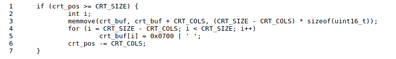

3. 对于以下问题，您可能想要去参考第2讲的讲义。这些讲义涵盖了GCC在x86上的调用约定。
逐步跟踪以下代码的执行：

```
int x = 1，y = 3，z = 4;
cprintf（“x％d，y％x，z％d \ n”，x，y，z）;
```

+ 在cprintf()中，fmt到底有什么意义？ap到底有什么意义？

+ 列出（按执行顺序）每次调用 cons_putc，va_arg和vcprintf。对于cons_putc，也列出其论点。对于 va_arg，列出ap呼叫之前和之后的点。对于vcprintf名单的两个参数的值。

4. 运行以下代码。

```
unsigned int i = 0x00646c72;
cprintf（“H％x Wo％s”，57616，＆i）;
```
输出的是什么？根据上一练习的单步调试的方式,解释此输出是如何得出的。 这是一个将字节映射到字符的[ASCII表](http://web.cs.mun.ca/~michael/c/ascii-table.html)。

输出取决于x86是little-endian的事实。为了产生相同的输出,如果x86是big-endian,你会把i设置为什么？您需要更改57616为其他值吗？

[Here's a description of little- and big-endian ](http://www.webopedia.com/TERM/b/big_endian.html)and[ a more whimsical description](http://www.networksorcery.com/enp/ien/ien137.txt).

5. 在下面的代码中，在'y='的后面,将要打印出什么？（注意：答案不是具体的值。）为什么会这样？
    cprintf（“x =％dy =％d”，3）;

6. 假设GCC改变了它的调用约定，以便它按声明顺序在堆栈上对参数压栈，以便最后一个参数最后压栈。为了使它仍然可以传递可变数量的参数,你将如何更改`cprintf`或其接口？

<table><tr><td>

挑战:增强控制台以允许以不同颜色打印文本。执行此操作的传统方法是使其解释 嵌入在打印到控制台的文本字符串中的 ANSI转义序列，但您可以使用任何您喜欢的机制。 有关VGA显示硬件编程的6.828参考页面和网络上的其他信息有很多信息 。如果您真的喜欢探索，可以尝试将VGA硬件切换到图形模式，并使控制台将文本绘制到图形帧缓冲区。
</td></tr></table>

#### 栈

在本实验的最后练习中，我们将更详细地探讨C语言在x86上使用栈的方式，并在此过程中编写一个可用的新的内核监视器函数，用于打印栈的回溯：来自嵌套调用指令的指令指针（IP）值的已保存的列表,导致当前执行点。

<table><tr><td>

练习9. 确定内核初始化栈的位置，以及栈所在内存的确切位置。内核如何为其栈保留空间？并且在这个保留区域的“末尾”在栈指针初始化后,指向哪里？
</td></tr></table>

x86堆栈指针（esp寄存器）指向当前正在使用的堆栈上的最低位置。保留给栈的区域中该位置以下的所有内容都是未使用的。将值压入栈涉及减小栈指针，然后将值写入栈指针指向的位置。从栈中弹出一个值包括读取栈指针指向的值，然后增加堆栈指针。在32位模式下，堆栈只能保存32位值，esp总是可以被4整除。各种x86指令（例如调用）以“hard-wired”的方式使用栈指针寄存器。

EBP（基址指针）寄存器，与此相反，与所述栈主要由软件约定相关联。在进入C函数时，函数的开始代码通常通过压栈来保存先前函数的基指针，然后在函数内将当前esp的值复制到ebp中。如果程序中的所有函数都遵循这个约定，那么在程序执行期间的任何给定点，都可以通过跟踪保存的ebp回溯栈。并且能确定指针嵌套的函数调用序列是否会导致到达程序中的这个特定点。此功能可能特别有用，例如，因为错误的参数传递,导致某个特定函数断言失败或恐慌时， ，而您不确定是谁传递了错误的参数。栈回溯可让您找到有问题的函数。

<table><tr><td>
练习10. 要熟悉x86上的C的调用约定，在` obj/kern/kernel.asm`中找到`test_backtrace`函数的地址，在那里设置断点，并检查每次在内核启动后调用它时会发生什么。每个递归嵌套级别test_backtrace的堆栈有多少32位字，这些字是什么？

请注意，为使本练习正常工作，您应该使用工具页面或Athena上提供的QEMU修补版本。否则，您必须手动将所有断点和内存地址转换为线性地址。
</td></tr></table>

上面的练习应该为您提供实现堆栈回溯功能所需的信息，这个函数叫mon_backtrace()。这个函数的原型已经在`kern/monitor.c`中等着你了。你可以完全用C语言完成，但你可能会发现`inc/x86.h`中的read_ebp()函数很有用。您还必须将此新函数挂到内核监视器的命令列表中，以便用户可以交互地调用它。

回溯函数应按以下格式显示函数调用帧列表：

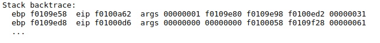

每行包含一个ebp，eip和args。在ebp的值表示该函数所使用的栈的基指针：即，函数被调用后的栈指针和设置基指针函数序言代码。列出的eip值是函数的返回指令指针：当函数返回时控件将返回的指令地址。返回的指令指针通常指向调用指令之后的指令（为什么？）。最后，args之后列出的五个十六进制值是在问题中提到的函数的前五个参数，它们在调用函数之前就被压入栈中。如果调用函数少于五个参数，当然，并非所有这五个值都有用。（为什么回溯代码不能检测到实际存在多少个参数？如何修复此限制？）

打印的第一行反映当前正在执行的函数，即mon_backtrace本身，第二行反映调用的函数` mon_backtrace`,第三行反映调用该函数的函数，依此类推。您应该打印所有未完成的栈帧。通过研究`kern/entry.S `你会发现有一种简单的方法可以判断何时停止。

对于以下练习和未来的实验,以下是您在阅读K＆R的第5章的一些值得记住的要点。

+ 如果int *p = (int*)100，那么 (int)p + 1和(int)(p + 1) 是不同的数字：第一个是101但第二个是104。向指针添加整数时，如第二种情况，整数隐式乘以指针指向的对象的大小。
+ p[i]与*(p+i)是相同的,p都是指向内存中的第i个对象。上述添加的规则有助于此定义在对象大于一个字节时起作用。
+ &p[i]与(p+i)是相同的,p指向内存中第i个对象的地址。

虽然大多数C程序从不需要在指针和整数之间进行转换，但操作系统经常这样做。每当您看到涉及内存地址的加法时，请你自己确定是整数加法还是指针加法，并确保增加的值是否适当相乘。

<table><tr><td>

练习11. 实现上面指定的回溯函数。使用与示例中相同的格式，否则评分脚本将会混淆。如果您认为它正常工作，请运行`make grade`以查看其输出是否符合我们的评分脚本所期望的值，如果不符合则修改它。 在提交实验1代码后，欢迎您以任何方式更改回溯功能的输出格式。

如果你使用`read_ebp()`，请注意,GCC在` mon_backtrace()`函数序言之前调用read_ebp()可能生成“优化的”代码，这会导致栈跟踪不完整（最近的函数调用的栈帧丢失）。虽然我们尝试禁用导致这种重新排序的优化，但你可能需要检查` mon_backtrace()`的汇编代码,以确保read_ebp()是在函数序言之后被调用的。
</td></tr></table>

此时，您的回溯函数应该为您提供了栈中调用mon_backtrace() 的函数的地址。但是，在实践中，您通常会想知道与这些地址对应的函数名称。例如，您可能想知道哪些函数可能包含导致内核崩溃的错误。

为了帮助您实现这个功能，我们提供了函数` debuginfo_eip()`，其在符号表中查找EIP，并返回该地址的调试信息。该函数在` kern/kdebug.c`中定义。

<table><tr><td>

练习12. 修改栈回溯函数，每个eip与函数名称，源文件名和与eip相对应的行号。

在`debuginfo_eip`中,`__STAB_ *`来自哪里？这个问题答案很长; 为了帮助您找到答案，以下是您可能需要做的一些事情：

+ 在文件`kern/kernel.ld`中查找`__STAB_ *`
+ 运行 `objdump -h obj/kern/kernel`
+ 运行 `objdump -G obj/kern/kernel`
+ 运行`gcc -pipe -nostdinc -O2 -fno-builtin -I. -MD -Wall -Wno-format -DJOS_KERNEL -gstabs -c -S kern/init.c`，查看`init.s`.
+ 查看引导加载程序是否在内存中加载符号表作为加载内核二进制文件的一部分

通过插入` stab_binsearch`调用来完成` debuginfo_eip`的实现，` stab_binsearch`可以查找地址的行号。

将一个backtrace命令添加到内核​​监视器，并增加您的` mon_backtrace`实现以调用`debuginfo_eip`并为每个格式的栈帧打印一行：

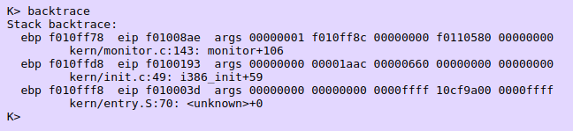

每行给出栈帧eip的文件中的文件名和行，后跟着函数的名称和eip到函数的第一条指令的偏移量（例如，`monitor + 106`表示,在监视器的开头,返回的eip为106字节）。

请务必在单独的行上打印文件和函数名称，以避免混淆评分脚本。

提示：printf格式字符串提供了一种简单但非常模糊的方式来打印非空终止字符串，如STABS表中的字符串。	`printf("%.*s", length, string)`打印最多的`length`长度的字符`string`。查看printf手册页，了解其工作原理。

您可能会发现回溯中缺少某些功能。例如，您可能会看到调用`monitor()`而不是调用`runcmd()`。这是因为编译器内联了一些函数调用。其他优化可能会导致您看到意料之外的行号。如果从` GNUMakefile`中删除`-O2`，则回溯可能更有意义（但内核运行速度会更慢）。
</td></tr></table>

**这样就完成了实验室。**
在实验室目录中，使用提交更改`git commit`并键入`make handin`以提交代码。