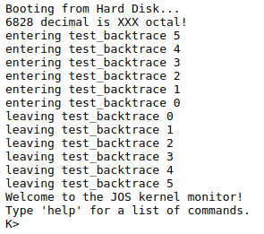

## 实验1：启动PC
>*截止日期为2018年9月13日*

### 简介

本实验分为三个部分。第一部分专注于熟悉x86汇编语言，QEMU x86模拟器以及PC的开机自举程序。第二部分检查我们的6.828内核的引导加载程序，它位于`lab`目录下的`boot`目录中。最后，第三部分深入研究名为JOS的6.828内核本身的初始模板，它位于`kernel`目录中。

### 软件设置

本课程中此实验作业和后续实验作业所需的文件将使用Git 版本控制系统进行分发。要了解有关Git的更多信息，请查看  [Git user's manual](https://mirrors.edge.kernel.org/pub/software/scm/git/docs/user-manual.html)，或者，如果您已熟悉其他版本控制系统，那么这本[CS-oriented overview of Git](https://eagain.net/articles/git-for-computer-scientists/)可能会有用。

这个课程Git存储库的URL是 <https://pdos.csail.mit.edu/6.828/2018/jos.git> 。要在Athena帐户中安装文件，您需要通过运行以下命令来克隆课程存储库。你必须使用基于x86架构的Athena机器; 也就是说，执行`uname -a`应该出现i386 GNU / Linux或i686 GNU / Linux或 x86_64 GNU / Linux。您可以使用`ssh -X athena.dialup.mit.edu`登录公共Athena主机。


Git允许您查看您对代码的改动。例如，如果您已完成其中一个练习，并想要检查您的进度，则可以通过运行以下命令提交更改：

 

您可以使用 `git diff` 命令跟踪更改。运行git diff将显示自上次提交后代码的更改，`git diff origin/lab1`并将显示相对于为本实验提供的初始代码的更改。这里，origin / lab1是git分支的名称，其中包含从我们的服务器下载的用于此作业的初始代码。

我们在Athena为您设置了适当的编译器和模拟器。要使用它们，请运行`add -f 6.828`。每次登录时都必须运行此命令（或将其添加到 〜/ .environment文件中）。如果在编译或运行qemu时遇到未知错误，请仔细检查是否添加了课程锁定器。

如果您正在使用非Athena机器，则需要按照[工具页面](https://pdos.csail.mit.edu/6.828/2018/tools.html)上的说明安装 qemu和gcc。我们已经对qemu进行了一些有用的调试更改，一些后来的实验依赖于这些补丁，因此您必须构建自己的补丁。如果你的机器采用的是原生ELF工具链（如Linux和BSD最多的，但值得注意的是不是 OS X），你可以简单地使用你的包管理器安装 GCC。否则，请按照工具页面上的说明进行操作。

### 交作业流程

您将使用[这个网站](https://6828.scripts.mit.edu/2018/handin.py/)上交作业。您需要先从网站申请API密钥，然后才能上交任何作业或实验。

实验代码附带GNU Make规则，使提交更容易。完成实验后，输入`make handin`提交实验代码。


`make handin`将您的API密钥存储在myapi.key中。如果您需要更改API密钥，只需删除此文件并make handin 再次生成（myapi.key不能包含换行符）。
如果使用`make handin`并且您有未经修改的更改或未跟踪的文件，您将看到类似于以下内容的输出：

```
 M hello.c
?? bar.c
?? foo.pyc
Untracked files will not be handed in. Continue？[Y / N]
```

检查上述行并确保有跟踪实验解决方案所需的所有文件，即未列在以`??`为开头的行中。

在这种情况下`make handin`不能正常工作，请尝试使用`curl`或`Git`命令解决了这个问题。或者你可以运行`make tarball`。这将为您创建一个tar文件，然后您可以通过我们的[Web网站](https://6828.scripts.mit.edu/2018/handin.py/)上传 。

您可以使用`make grade`来运行评分程序以测试您的解决方案。该[web interface](https://6828.scripts.mit.edu/2018/handin.py/)使用相同的分级方案来评定您的实验的档次。您应该查看评分程序的评分（定期运行的评分程序可能需要几分钟）并确保您收到了预期的等级。如果成绩不匹配，您的实验室提交可能有错误 - 检查评分程序的结果（resp-lab * .txt）以查看哪个特定测试有失败。

对于实验1，您无需回答下面的任何问题。（尽管你们可以回答！并且这样将会有利于余下的实验。）

### 第1部分：PC Bootstrap

第一个练习的目的是向您介绍x86汇编语言和PC引导程序，并开始使用QEMU和QEMU / GDB调试。您不必为实验室的这一部分编写任何代码，但无论如何您都应该通过它来进行自己的理解，并准备好回答下面提出的问题。

#### x86组装入门

如果您还不熟悉x86汇编语言，那么在本课程中您将很快熟悉它！[PC Assembly Language Book](https://pdos.csail.mit.edu/6.828/2018/readings/pcasm-book.pdf)这本书就是一个很好的入门书。希望对你来说这是一本经典和现代知识相结合的书。

注意：不幸的是，本书中的示例是为NASM汇编程序编写的，而我们将使用GNU汇编程序。NASM使用所谓的Intel语法，而GNU使用AT＆T语法。虽然在语义上是等效的，但是程序集文件会有很大不同，至少表面上看，这取决于使用的语法。幸运的是，两者之间的转换非常简单，并且在 Brennan的内联汇编指南中有所介绍。

<table><tr><td>
练习1. 熟悉6.828参考页面上提供的汇编语言材料 。您现在不必阅读它们，
但在阅读和编写x86程序集时，您几乎肯定会想要参考这些材料。
</td></tr></table>

我们建议您阅读Brennan的内联汇编指南中的 “语法”部分 。它给出了我们将在JOS中使用GNU汇编程序的AT＆T汇编语法的一个很好的（并且非常简短）描述。

当然，x86汇编语言编程的权威参考是英特尔的指令集架构参考，您可以在6.828参考页面上找到 两种版本：旧版80386程序员参考手册的HTML版本 ，它比更多更简单，更易于导航最近的手册，但描述了我们将在6.828中使用的所有x86处理器功能; 以及来自英特尔的完整，最新和最好的 IA-32英特尔架构软件开发人员手册，涵盖了我们在课堂上不需要的最新处理器的所有功能，但您可能有兴趣了解这些功能。AMD提供了一套等效（通常更友好）的手册 。保存Intel / AMD体系结构手册以供日后使用，或者在您想要查找特定处理器功能或指令的明确说明时将其用作参考。

#### 模拟x86

我们不是在真实的个人计算机（PC）上开发操作系统，而是使用忠实模拟完整PC的程序：您为仿真器编写的代码也将在真实PC上启动。使用仿真器简化了调试; 例如，您可以在模拟x86内部设置断点，这对于x86的硅版本很难实现。

在6.828中，我们将使用 QEMU仿真器，一个现代且相对快速的仿真器。虽然QEMU的内置监视器仅提供有限的调试支持，但QEMU可以作为GNU调试器（GDB）的远程调试目标 ，我们将在本实验中使用它来逐步完成早期启动过程。

首先，如上面“软件设置”中所述，将Lab 1文件解压缩到Athena上您自己的目录中，然后在lab目录中键入make（或gmake在BSD系统上）以构建最初的6.828引导加载程序和内核。（将我们在这里运行的代码称为“内核”有点慷慨，但我们会在整个学期内充实它。）


（如果你得到“未定义引用`__udivdi3'”之类的错误，你可能没有32位gcc multilib。如果你正在运行Debian或Ubuntu，请尝试安装gcc-multilib包。）

现在您已准备好运行QEMU，将上面创建的文件obj / kern / kernel.img作为模拟PC“虚拟硬盘”的内容提供。此硬盘映像包含我们的引导加载程序（obj / boot / boot）和我们的内核（obj / kernel）。


这将执行QEMU，其中包含将硬盘和直接串行端口输出设置到终端所需的选项。某些文本应出现在QEMU窗口中：



“ 从硬盘启动...... ” 之后的所有内容都是由我们的骨架JOS内核打印出来的; 的K>是由小的印刷提示监视器，或交互式控制程序，我们已经包含在内核中。如果你用过 make qemu，内核打印的这些行将出现在运行QEMU的常规shell窗口和QEMU显示窗口中。这是因为为了测试和实验室评分的目的，我们设置了JOS内核，不仅将其控制台输出写入虚拟VGA显示器（如QEMU窗口中所示），还将其写入模拟PC的虚拟串行端口，QEMU位于将输出转换为自己的标准输出。同样，JOS内核将从键盘和串行端口获取输入，因此您可以在VGA显示窗口或运行QEMU的终端中输入命令。或者，您可以通过运行使用不带虚拟VGA的串行控制台make qemu-nox。如果您通过SSH连接到Athena拨号，这可能很方便。要退出qemu，请键入Ctrl+a x。

您只能向内核监视器，help和kerninfo提供两个命令 。


该帮助命令是显而易见的，我们不久将讨论什么意思kerninfo命令打印。虽然很简单，但重要的是要注意这个内核监视器“直接”在模拟PC的“原始（虚拟）硬件”上运行。这意味着您应该能够将obj / kern / kernel.img的内容复制 到真实硬盘的前几个扇区，将该硬盘插入真正的PC，打开它，然后看到完全相同的东西。正如您在QEMU窗口中所做的那样，PC的真实屏幕。（我们不建议您在真正的计算机上使用其硬盘上的有用信息执行此操作，因为复制kernel.img 在其硬盘的开头将垃圾主引导记录和第一个分区的开头，有效地导致以前在硬盘上的所有内容丢失！）

#### PC的物理地址空间

我们现在将深入探讨有关PC如何启动的更多细节。PC的物理地址空间是硬连线的，具有以下总体布局：


第一批基于16位Intel 8088处理器的PC仅能够处理1MB的物理内存。因此，早期PC的物理地址空间将从0x00000000开始，但以0x000FFFFF而不是0xFFFFFFFF结束。标有“低内存”的640KB区域是早期PC可以使用的唯一随机存取存储器（RAM）; 事实上，最早的PC只能配置16KB，32KB或64KB的RAM！

从0x000A0000到0x000FFFFF的384KB区域由硬件保留用于特殊用途，例如视频显示缓冲区和非易失性存储器中保存的固件。此保留区域最重要的部分是基本输入/输出系统（BIOS），它占用从0x000F0000到0x000FFFFF的64KB区域。在早期的PC中，BIOS保存在真正的只读存储器（ROM）中，但是当前的PC将BIOS存储在可更新的闪存中。BIOS负责执行基本系统初始化，例如激活视频卡和检查安装的内存量。执行此初始化后，BIOS从某些适当的位置（如软盘，硬盘，CD-ROM或网络）加载操作系统，并将机器的控制权交给操作系统。

当英特尔最终“分别支持16MB和4GB物理地址空间的80286和80386处理器”打破了“1兆字障”时，PC架构师仍保留了原有的低1MB物理地址空间布局，以确保向后兼容现有软件。因此，现代PC在物理内存中有一个“漏洞”，从0x000A0000到0x00100000，将RAM分为“低”或“常规内存”（第一个640KB）和“扩展内存”（其他所有内容）。此外，PC的32位物理地址空间顶部的一些空间，尤其是物理RAM，现在通常由BIOS保留，供32位PCI设备使用。

最近x86处理器可以支持 更多的比4GB的物理内存，以便RAM可以在上面0xFFFFFFFF的进一步延伸。在这种情况下，BIOS必须安排在32位可寻址区域顶部的系统RAM中留下第二个孔，为这些32位设备留出空间。由于设计限制，无论如何，JOS将只使用PC的物理内存的第一个256MB，所以现在我们将假装所有PC“仅”拥有32位物理地址空间。但是处理复杂的物理地址空间和多年来发展的硬件组织的其他方面是OS开发的重要实际挑战之一。

#### ROM BIOS

在本部分实验中，您将使用QEMU的调试工具来研究IA-32兼容计算机的启动方式。

将两个终端窗口和cd两个shell 打开到您的lab目录中。在一个中，输入make qemu-gdb（或make qemu-nox-gdb）。这将启动QEMU，但QEMU在处理器执行第一条指令之前停止，并等待来自GDB的调试连接。在第二个终端中，从运行make，run 的同一目录开始make gdb。你应该看到这样的东西，


我们提供了一个.gdbinit文件，用于设置GDB以调试早期启动期间使用的16位代码，并将其指向附加到侦听QEMU。（如果它不工作，你可能需要添加一个插件自动加载安全路径在 .gdbinit你的home目录说服GDB处理 .gdbinit我们提供的。 GDB会告诉你，如果你要做这个。）

以下行：

`[f000：fff0] 0xffff0：ljmp $ 0xf000，$ 0xe05b`

是GDB对要执行的第一条指令的反汇编。从这个输出中你可以得出以下结论：

+ IBM PC开始在物理地址0x000ffff0处执行，该地址位于为ROM BIOS保留的64KB区域的最顶端。
+ PC开始执行CS = 0xf000和IP = 0xfff0。
+ 要执行的第一条指令是jmp指令，它跳转到分段地址 CS = 0xf000和IP = 0xe05b。

为什么QEMU会这样开始？这就是英特尔如何设计IBM在其原始PC中使用的8088处理器。由于PC中的BIOS与物理地址范围0x000f0000-0x000fffff“硬连线”，因此该设计可确保BIOS在上电或任何系统重启后始终首先控制机器 - 这对于电源而言至关重要 - 那里是没有其他的软件在机器的RAM的任何地方，该处理器可以执行。QEMU仿真器带有自己的BIOS，它放置在处理器的模拟物理地址空间中的这个位置。在处理器复位时，（模拟）处理器进入实模式并将CS设置为0xf000，将IP设置为0xfff0，以便从该（CS：IP）段地址开始执行。分段地址0xf000如何：

要回答这个问题，我们需要了解一下实模式寻址。在实模式（PC启动的模式）中，地址转换根据以下公式工作： 物理地址 = 16 * 段 + 偏移。因此，当PC将CS设置为0xf000且IP设置为0xfff0时，引用的物理地址为：

```
   16×0xf000 + 0xfff0＃十六进制乘以16是
   = 0xf0000 + 0xfff0＃easy  - 只需追加0。
   = 0xffff0 
```

0xffff0是BIOS结束前的16个字节（0x100000）。因此，我们不应该感到惊讶的是，BIOS所做的第一件事是jmp倒退到BIOS的早期位置; 毕竟它只能在16个字节内完成多少？

<table><tr><td>
练习2. 使用GDB si（步骤指令）命令跟踪ROM BIOS以获取更多指令，并尝试猜测它可能正在做什么。您可能需要查看 Phil Storrs I / O端口说明以及6.828参考资料页面上的其他材料 。无需弄清楚所有细节 - 只是首先了解BIOS的主要内容。
</td></tr></table>

当BIOS运行时，它会设置一个中断描述符表并初始化各种设备，如VGA显示器。这是您在QEMU窗口中看到的“ Starting SeaBIOS ”消息的来源。

初始化PCI总线和BIOS知道的所有重要设备后，它会搜索可引导设备，如软盘，硬盘驱动器或CD-ROM。最终，当它找到可引导磁盘时，BIOS 从磁盘读取引导加载程序并将控制权转移给它。

### 第2部分：引导加载程序

PC的软盘和硬盘分为512个字节区域，称为扇区。扇区是磁盘的最小传输粒度：每个读取或写入操作必须是一个或多个扇区，并在扇区边界上对齐。如果磁盘是可引导的，则第一个扇区称为引导扇区，因为这是引导加载程序代码所在的位置。当BIOS找到可引导的软盘或硬盘时，它将512字节的引导扇区加载到物理地址0x7c00到0x7dff的内存中，然后使用jmp指令将CS：IP设置为0000：7c00，将控制权传递给引导装载机。与BIOS加载地址一样，这些地址相当随意 - 但它们是针对PC修复和标准化的。

在PC的发展过程中，从CD-ROM启动的能力要晚得多，因此PC架构师借此机会稍微重新考虑启动过程。因此，现代BIOS从CD-ROM引导的方式有点复杂（而且功能更强大）。CD-ROM使用的扇区大小为2048字节而不是512，并且BIOS可以在将控制转移到内存之前将更大的引导映像从磁盘加载到内存（而不仅仅是一个扇区）。有关详细信息，请参阅“El Torito”可引导CD-ROM格式规范。

但是，对于6.828，我们将使用传统的硬盘启动机制，这意味着我们的启动加载程序必须适合512字节。引导加载程序包含一个汇编语言源文件boot / boot.S和一个C源文件boot / main.c 仔细查看这些源文件，确保您了解正在发生的事情。引导加载程序必须执行两个主要功能：

1. 首先，引导加载程序将处理器从实模式切换到 32位保护模式，因为只有在此模式下，软件才能访问处理器物理地址空间中1MB以上的所有内存。保护模式在PC汇编语言的 1.2.7和1.2.8节 中有详细介绍，在英特尔架构手册中有详细介绍。此时，您只需要了解将分段地址（段：偏移对）转换为物理地址在保护模式下的转换方式不同，并且在转换偏移之后转换为32位而不是16位。
2. 其次，引导加载程序通过x86的特殊I / O指令直接访问IDE磁盘设备寄存器，从硬盘读取内核。如果您想更好地了解这里的特定I / O指令，请查看6.828参考页上的 “IDE硬盘控制器”部分。您不需要了解有关在此类中编程特定设备的知识：编写设备驱动程序实际上是操作系统开发的一个非常重要的部分，但从概念或架构的角度来看，它也是最不感兴趣的部分之一。

在了解了引导加载程序源代码之后，请查看文件obj / boot / boot.asm。此文件是我们的GNUmakefile 在编译引导加载程序后创建的引导加载程序的反汇编。这个反汇编文件可以很容易地查看所有引导加载程序代码所在的物理内存的确切位置，并且可以更轻松地跟踪在GDB中单步执行引导加载程序时发生的情况。同样，obj / kern / kernel.asm包含一个JOS内核的反汇编，它通常可用于调试。

您可以使用b 命令在GDB中设置地址断点。例如，b *0x7c00在地址0x7C00处设置断点。一旦在断点处，可以使用继续执行c与 si命令：c使QEMU继续执行，直到下一个断点（或者直至按下 Ctrl-C在GDB），并通过该指令的步Ñ在一个时间。 si N

要检查内存中的指令（除了下一个要执行的x/i指令，GDB自动打印），您可以使用该 命令。此命令具有语法 ，其中N是要反汇编的连续指令的数量，ADDR是开始反汇编的内存地址。 x/Ni ADDR

<table><tr><td>
练习3. 查看实验室工具指南，尤其是关于GDB命令的部分。即使您熟悉GDB，也包括一些对OS工作有用的深奥GDB命令。

在地址0x7c00处设置断点，这是加载引导扇区的位置。继续执行直到该断点。通过跟踪代码开机/ boot.S，使用的源代码和反汇编文件 OBJ的/ boot / boot.asm跟踪你在哪里。还可以使用GDB中的x / i命令来反汇编引导加载程序中的指令序列，并将原始引导加载程序源代码与obj / boot / boot.asm 和GDB中的反汇编进行比较。

跟踪到bootmain（）在启动/ main.c中，然后进入readsect（） 。确定与readsect（）中每个语句对应的精确汇编指令。跟踪readsect（）的其余部分 并返回到bootmain（），并识别for循环的开始和结束，从磁盘读取内核的剩余扇区。找出循环结束时将运行的代码，在那里设置断点，并继续该断点。然后逐步执行引导加载程序的其余部分。
</td></tr></table>

能够回答以下问题：

+ 处理器在什么时候开始执行32位代码？究竟是什么导致从16位模式切换到32位模式？
+ 执行的引导加载程序	的最后一条指令是什么，它刚加载的内核的第一条指令是什么？
+ 内核的第一条指令在哪里？
+ 引导加载程序如何决定从磁盘获取整个内核必须读取多少扇区？它在哪里找到这些信息？

#### 加载内核

现在，我们将在boot / main.c中的引导加载程序的C语言部分详细介绍。但在此之前，现在是停止和回顾一些C编程基础知识的好时机。

<table><tr><td>
练习4. 阅读C语言中的指针编程 .B 语言的最佳参考是Brian Kernighan和Dennis Ritchie 编写的C语言编程语言（称为“K＆R”）。我们建议学生购买这本书（这里是 亚马逊链接）或找到 麻省理工学院的7本副本之一。

通过K＆R中的5.5（字符指针和函数）阅读5.1（指针和地址）。然后下载pointers.c的代码 ，运行它，并确保您了解所有打印值的来源。特别是，请确保您了解打印行1和6中指针所在的位置，打印行2到4中的所有值是如何到达的，以及为什么第5行中打印的值看似已损坏。

关于C中的指针还有其他参考文献（例如，Ted Jensen的一篇教程，其中引用了K＆R），尽管没有强烈推荐。

警告： 除非你已经精通C语言，否则不要跳过甚至略过这个阅读练习。如果你真的不理解C中的指针，你将在后续的实验中遭受无尽的痛苦和痛苦，然后最终以艰难的方式理解它们。相信我们; 你不想知道“艰难的方式”是什么。
</td></tr></table>

要理解boot / main.c， 你需要知道ELF二进制文件是什么。当您编译和链接诸如JOS内核的C程序时，编译器将每个C源（' .c '）文件转换为对象（' .o '）文件，该文件包含以硬件所需的二进制格式编码的汇编语言指令。 。然后，链接器将所有编译的目标文件组合成单个二进制映像，例如obj / kern / kernel，在这种情况下，它是ELF格式的二进制文件，代表“可执行和可链接格式”。

有关此格式的完整信息，请 参阅我们的参考页面 上的ELF规范，但您无需深入研究此类中此格式的详细信息。虽然整个格式非常强大和复杂，但大多数复杂的部分都支持动态加载共享库，我们在这个类中不会这样做。在维基百科页面有一个简短的描述。

出于6.828的目的，您可以将ELF可执行文件视为带有加载信息的标头，后跟几个程序部分，每个程序部分是一个连续的代码块或数据，用于加载到指定地址的内存中。引导加载程序不会修改代码或数据; 它将其加载到内存中并开始执行它。

ELF二进制文件以固定长度的ELF头开始，后跟可变长度的程序头， 列出要加载的每个程序段。这些ELF头的C定义在inc / elf.h中。我们感兴趣的计划部分是：

+ .text：程序的可执行指令。
+ .rodata：只读数据，例如C编译器生成的ASCII字符串常量。（但是，我们不会费心设置硬件来禁止写入。）
+ .data：数据部分保存程序的初始化数据，例如使用初始化器（如int x = 5）声明的全局变量; 。

当链接器计算程序的内存布局时，它为未初始化的全局变量保留空间，例如int x; ，在一个名为.bss的部分中 ，紧跟在内存中的.data之后。C要求“未初始化”的全局变量以零值开头。因此，不需要 在ELF二进制文件中存储.bss的内容; 相反，链接器只记录.bss部分的地址和大小。加载程序或程序本身必须安排将.bss部分归零 。

通过键入以下内容，检查内核可执行文件中所有部分的名称，大小和链接地址的完整列表：


（如果您编译了自己的工具链，则可能需要使用i386-jos-elf-objdump）
您将看到比我们上面列出的更多的部分，但其他部分对我们的目的并不重要。其他大多数都是保存调试信息，调试信息通常包含在程序的可执行文件中，但不会被程序加载器加载到内存中。

请特别注意.text部分的“VMA”（或链接地址）和“LMA”（或加载地址） 。段的加载地址是应该将该段加载到内存中的内存地址。

段的链接地址是段期望执行的内存地址。链接器以各种方式对二进制文件中的链接地址进行编码，例如当代码需要全局变量的地址时，如果二进制文件从未链接的地址执行，则二进制文件通常不起作用。 。（可以生成不包含任何此类绝对地址的与位置无关的代码。现代共享库广泛使用它，但它具有性能和复杂性成本，因此我们不会在6.828中使用它。）

通常，链接和加载地址是相同的。例如，查看引导加载程序的.text部分：


引导加载程序使用ELF 程序头来决定如何加载节。程序头指定要加载到内存中的ELF对象的哪些部分以及每个应占用的目标地址。您可以键入以下内容来检查程序标题：


然后，程序头在objdump的输出中的“Program Headers”下列出。需要加载到内存中的ELF对象的区域是标记为“LOAD”的区域。给出了每个程序头的其他信息，例如虚拟地址（“vaddr”），物理地址（“paddr”）和加载区域的大小（“memsz”和“filesz”）。

回到boot / main.c，ph->p_pa每个程序头的字段包含段的目标物理地址（在这种情况下，它实际上是一个物理地址，尽管ELF规范对该字段的实际含义含糊不清）。

BIOS将引导扇区加载到从地址0x7c00开始的内存中，因此这是引导扇区的加载地址。这也是引导扇区执行的地方，因此这也是它的链接地址。我们通过将-Ttext 0x7C00传递给boot / Makefrag中的链接器来 设置链接地址，因此链接器将在生成的代码中生成正确的内存地址。

<table><tr><td>
练习5. 再次跟踪引导加载程序的前几条指令，并确定第一条指令将“中断”或以其他方式执行错误的操作，如果您要使引导加载程序的链接地址错误。然后将boot / Makefrag中的链接地址更改为 错误，运行make clean，重新编译实验make，然后再次跟踪到引导加载程序以查看发生的情况。不要忘记make clean之后反复更改链接地址！
</td></tr></table>

回顾一下内核的加载和链接地址。与引导加载程序不同，这两个地址不相同：内核告诉引导加载程序将其加载到低地址（1兆字节）的内存中，但它希望从高地址执行。我们将在下一节深入探讨如何使这项工作。

除了部分信息之外，ELF头中还有一个对我们很重要的字段，名为e_entry。该字段保存程序中入口点的链接地址：程序应该开始执行的程序文本部分中的存储器地址。你可以看到入口点：


您现在应该能够理解boot / main.c中的最小ELF加载器 。它将内核的每个部分从磁盘读入内存的部分加载地址，然后跳转到内核的入口点。

<table><tr><td>
练习6. 我们可以使用GDB的x命令检查内存。该 GDB手册有充分的细节，但就目前而言，这是不够了解，命令打印 ñ在内存中的字ADDR。（请注意，命令中的' x '都是小写的。） 警告：单词的大小不是通用标准。在GNU汇编中，一个字是两个字节（xorw中的'w'，代表字，表示2个字节）。 x/Nx ADDR

重置机器（退出QEMU / GDB并再次启动它们）。在BIOS进入引导加载程序时检查内存的8个字在0x00100000处，然后在引导加载程序进入内核时再次检查。他们为什么不同？第二个断点有什么？（你真的不需要用QEMU来回答这个问题。试想一下。）
</td></tr></table>

### 第3部分：内核

我们现在将开始更详细地研究最小的JOS内核。（最后你会写一些代码！）。与引导加载程序一样，内核从一些汇编语言代码开始，这些代码设置可以使C语言代码正确执行。

#### 使用虚拟内存来解决位置依赖问题

当您检查上面的引导加载程序的链接和加载地址时，它们完全匹配，但内核的链接地址（由objdump打印）与其加载地址之间存在（相当大）差异。回去检查两者，确保你能看到我们正在谈论的内容。（链接内核比引导加载程序更复杂，因此链接和加载地址位于kern / kernel.ld的顶部。）

操作系统内核通常喜欢链接并在非常高的虚拟地址（例如0xf0100000）下运行，以便留下处理器虚拟地址空间的下半部分供用户程序使用。在下一个实验室中，这种安排的原因将变得更加清晰。

许多机器在地址0xf0100000处没有任何物理内存，因此我们无法指望能够在那里存储内核。相反，我们将使用处理器的内存管理硬件将虚拟地址0xf0100000（内核代码期望运行的链接地址）映射到物理地址0x00100000（引导加载程序将内核加载到物理内存中）。这样，虽然内核的虚拟地址足够高，可以为用户进程留出足够的地址空间，但它将被加载到PC RAM的1MB点的物理内存中，就在BIOS ROM上方。这种方法要求PC至少有几兆字节的物理内存（因此物理地址0x00100000可以工作），但这可能适用于1990年以后建立的任何PC。

事实上，在下一个实验中，我们将把物理地址0x00000000到0x0fffffff 的整个底部256MB的物理地址空间分别映射到虚拟地址0xf0000000到0xffffffff。您现在应该看到为什么JOS只能使用前256MB的物理内存。

现在，我们只需映射前4MB的物理内存，这足以让我们启动并运行。我们使用kern / entrypgdir.c中手写的，静态初始化的页面目录和页表来 完成此操作。现在，您不必了解其工作原理的细节，只需了解其实现的效果。直到kern / entry.S设置CR0_PG标志，内存引用被视为物理地址（严格来说，它们是线性地址，但boot / boot.S设置从线性地址到物理地址的身份映射，我们永远不会要改变那个）。一旦CR0_PG设置，内存引用是由虚拟内存硬件转换为物理地址的虚拟地址。 entry_pgdir将0xf0000000到0xf0400000范围内的虚拟地址转换为物理地址0x00000000到0x00400000，以及虚拟地址0x00000000到0x00400000到物理地址0x00000000到0x00400000。任何不属于这两个范围之一的虚拟地址都会导致硬件异常，因为我们尚未设置中断处理，将导致QEMU转储机器状态并退出（如果不使用则无休止地重启QEMU的6.828补丁版本。

<table><tr><td>
练习7. 使用QEMU和GDB跟踪到JOS内核并停在movl %eax, %cr0。检查内存为0x00100000和0xf0100000。现在，使用stepiGDB命令单步执行该指令。再次检查内存为0x00100000和0xf0100000。确保你了解刚刚发生的事情。

在建立新映射后，如果映射不到位则无法正常工作 的第一条指令是什么？movl %eax, %cr0在 kern / entry.S中注释掉，跟踪它，看看你是否正确。
</td></tr></table>

#### 格式化打印到控制台

大多数人认为像printf（）这样的函数是理所当然的，有时甚至认为它们是C语言的“原语”。但在OS内核中，我们必须自己实现所有I / O.

通读kern / printf.c，lib / printfmt.c和kern / console.c，确保了解它们之间的关系。在后面的实验中将清楚为什么printfmt.c 位于单独的lib目录中。

<table><tr><td>
练习8. 我们省略了一小段代码 - 使用“％o”形式的模式打印八进制数所需的代码。查找并填写此代码片段。
</td></tr></table>

能够回答以下问题：

1. 解释printf.c和 console.c之间的接口。具体来说，console.c导出什么功能 ？printf.c如何使用此函数 ？
从console.c解释以下内容：


3. 对于以下问题，您可能希望参考第2讲的注释。这些注释涵盖了GCC在x86上的调用约定。
逐步跟踪以下代码的执行：

int x = 1，y = 3，z = 4;
cprintf（“x％d，y％x，z％d \ n”，x，y，z）;
在致电中cprintf()，到底有什么fmt意义？到什么ap点？
名单（按执行顺序）每次调用 cons_putc，va_arg和vcprintf。对于cons_putc，也列出其论点。对于 va_arg，列出ap呼叫之前和之后的点。对于vcprintf名单的两个参数的值。

4. 运行以下代码。

```
unsigned int i = 0x00646c72;
cprintf（“H％x Wo％s”，57616，＆i）;
```
什么是输出？解释此输出是如何以上一练习的逐步方式得出的。 这是一个将字节映射到字符的ASCII表。
输出取决于x86是little-endian的事实。如果x86是big-endian你会设置为什么i产生相同的输出？您需要更改 57616为其他值吗？

这是对小端 和大端的描述以及 更加异想天开的描述。

5. 在下面的代码中，将要打印 'y='什么？（注意：答案不是具体的值。）为什么会这样？
    cprintf（“x =％dy =％d”，3）;

6. 假设GCC改变了它的调用约定，以便它按声明顺序在堆栈上推送参数，以便最后推送最后一个参数。你将如何更改cprintf或其界面，以便仍然可以传递可变数量的参数？

<table><tr><td>
挑战 增强控制台以允许以不同颜色打印文本。执行此操作的传统方法是使其解释 嵌入在打印到控制台的文本字符串中的 ANSI转义序列，但您可以使用任何您喜欢的机制。 有关VGA显示硬件编程的6.828参考页面和网络上的其他信息有很多信息 。如果您真的喜欢冒险，可以尝试将VGA硬件切换到图形模式，并使控制台将文本绘制到图形帧缓冲区。
</td></tr></table>

#### 堆栈

在本实验的最后练习中，我们将更详细地探讨C语言在x86上使用堆栈的方式，并在此过程中编写一个有用的新内核监视器函数，用于打印堆栈的回溯：已保存的列表来自嵌套调用指令的指令指针（IP）值导致当前执行点。

<table><tr><td>
练习9. 确定内核初始化其堆栈的位置，以及堆栈所在内存的确切位置。内核如何为其堆栈保留空间？并且在这个保留区域的“结束”是堆栈指针初始化为指向？
</td></tr></table>

x86堆栈指针（esp寄存器）指向当前正在使用的堆栈上的最低位置。保留给堆栈的区域中该位置以下的所有内容都是免费的。将值压入堆栈涉及减少堆栈指针，然后将值写入堆栈指针指向的位置。从堆栈中弹出一个值包括读取堆栈指针指向的值，然后增加堆栈指针。在32位模式下，堆栈只能保存32位值，esp总是可以被4整除。各种x86指令（例如调用）被“硬连线”以使用堆栈指针寄存器。

的EBP（基址指针）寄存器，与此相反，与所述堆主要由软件约定相关联。在进入C函数时，函数的序言代码通常通过将其推入堆栈来保存先前函数的基本指针，然后 在函数持续时间内将当前esp值复制到ebp中。如果程序中的所有函数都遵循这个约定，那么在程序执行期间的任何给定点，都可以通过跟踪保存的ebp链回溯堆栈。指针并确切地确定嵌套的函数调用序列是否导致程序中的这个特定点到达。此功能可能特别有用，例如，当某个特定函数导致断言失败或恐慌时， 因为错误的参数传递给它，但您不确定是谁传递了错误的参数。堆栈回溯可让您找到有问题的功能。

<table><tr><td>
练习10. 要熟悉x86上的C调用约定，test_backtrace在obj / kern / kernel.asm中找到函数的地址，在那里设置断点，并检查每次在内核启动后调用它时会发生什么。每个递归嵌套级别test_backtrace的堆栈有多少32位字，这些字是什么？

请注意，为使本练习正常工作，您应该使用工具页面或Athena上提供的QEMU修补版本。否则，您必须手动将所有断点和内存地址转换为线性地址。
</td></tr></table>

上面的练习应该为您提供实现堆栈回溯功能所需的信息，您应该调用它mon_backtrace()。这个函数的原型已经在kern / monitor.c中等着你了。你可以完全用C语言完成，但你可能会发现inc / x86.h中的read_ebp()函数很有用。您还必须将此新函数挂钩到内核监视器的命令列表中，以便用户可以交互地调用它。

回溯函数应按以下格式显示函数调用帧列表：


每行包含一个ebp，eip和args。在EBP值表示基指针到由该函数所使用的堆栈：即，堆栈指针的被输入的函数只是后的位置和设置基指针函数序言代码。列出的eip值是函数的返回指令指针：当函数返回时控件将返回的指令地址。返回指令指针通常指向调用指令之后的指令（为什么？）。最后，args之后列出的五个十六进制值 是有问题的函数的前五个参数，它们在调用函数之前就被推到了堆栈上。如果用少于五个参数调用函数，当然，并非所有这五个值都有用。（为什么回溯代码不能检测到实际存在多少个参数？如何修复此限制？）

打印的第一行反映当前正在执行的函数，即mon_backtrace本身，第二行反映调用的函数，mon_backtrace第三行反映调用该函数的函数，依此类推。您应该打印所有未完成的堆栈帧。通过研究kern / entry.S 你会发现有一种简单的方法可以判断何时停止。

以下是您在K＆R第5章中阅读的一些具体要点，这些要点值得记住以下练习和未来的实验。

+ 如果int *p = (int*)100，那么 (int)p + 1和(int)(p + 1) 不同的数字：第一是101但第二次104。向指针添加整数时，如第二种情况，整数隐式乘以指针指向的对象的大小。
+ p[i]被定义为与*(p+i)p指向的内存中的第i个对象相同。上述添加规则有助于此定义在对象大于一个字节时起作用。
+ &p[i]与(p+i)p指向的内存中第i个对象的地址相同。

虽然大多数C程序从不需要在指针和整数之间进行转换，但操作系统经常这样做。每当您看到涉及内存地址的添加时，请问自己是添加整数还是添加指针，并确保添加的值是否适当相乘。

<table><tr><td>
练习11. 实现上面指定的回溯函数。使用与示例中相同的格式，否则将使评分脚本混淆。如果您认为它正常工作，请运行make grade以查看其输出是否符合我们的评分脚本所期望的值，如果不符合则修复它。 在提交实验1代码后，欢迎您以任何方式更改回溯功能的输出格式。

如果你使用read_ebp()，请注意GCC可能生成read_ebp() 在 mon_backtrace()函数序言之前调用的“优化”代码，这会导致堆栈跟踪不完整（缺少最近函数调用的堆栈帧）。虽然我们尝试禁用导致此重新排序的优化，但您可能需要检查程序集 mon_backtrace()并确保read_ebp()在函数序言之后发生调用 。
</td></tr></table>

此时，您的回溯函数应该为您提供堆栈中导致mon_backtrace() 执行的函数调用者的地址。但是，在实践中，您经常想知道与这些地址对应的函数名称。例如，您可能想知道哪些函数可能包含导致内核崩溃的错误。

为了帮助您实现这个功能，我们提供的功能 debuginfo_eip()，其查找EIP在符号表中，并返回该地址的调试信息。该函数在kern / kdebug.c中定义。

<table><tr><td>
练习12. 修改堆栈回溯功能，为每个eip显示与该eip对应的函数名称，源文件名和行号。

在debuginfo_eip哪里__STAB_ *来自哪里？这个问题答案很长; 为了帮助您找到答案，以下是您可能想要做的一些事情：

+ 在文件kern / kernel.ld中查找__STAB_ *
+ 跑 objdump -h obj/kern/kernel
+ 跑 objdump -G obj/kern/kernel
+ 运行gcc -pipe -nostdinc -O2 -fno-builtin -I. -MD -Wall -Wno-format -DJOS_KERNEL -gstabs -c -S kern/init.c，看看init.s.
+ 查看引导加载程序是否在内存中加载符号表作为加载内核二进制文件的一部分
debuginfo_eip通过插入调用来完成实现，stab_binsearch以查找地址的行号。

将一个backtrace命令添加到内核​​监视器，并扩展您的实现mon_backtrace以调用debuginfo_eip并为该窗体的每个堆栈帧打印一行：


每行给出堆栈帧eip的文件中的文件名和行，后跟函数的名称和eip与函数的第一条指令的偏移量（例如，monitor + 106表示返回eip为106字节过了监视器的开头 ）。

请务必在单独的行上打印文件和函数名称，以避免混淆评分脚本。

提示：printf格式字符串提供了一种简单但非常模糊的方式来打印非空终止字符串，如STABS表中的字符串。	printf("%.*s", length, string)打印最多的length字符string。查看printf手册页，了解其工作原理。

您可能会发现回溯中缺少某些功能。例如，您可能会看到呼叫monitor()而不是呼叫 runcmd()。这是因为编译器内联了一些函数调用。其他优化可能会导致您看到意外的行号。如果从 GNUMakefile中删除-O2，则回溯可能更有意义（但内核运行速度会更慢）。
</td></tr></table>

**这样就完成了实验室。**
在实验室目录中，使用提交更改`git commit`并键入make handin以提交代码。