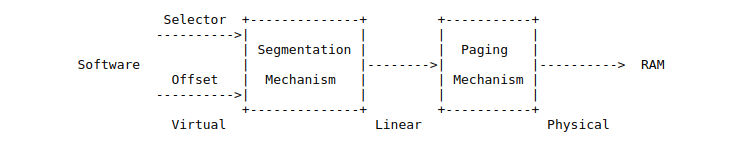
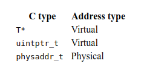

## 实验2：内存管理
>*截止日期为2018年9月27日*

### 介绍

在本实验中，您将编写操作系统的内存管理代码。内存管理有两个组成部分。

第一个组件是内核的物理内存分配器，因此内核可以分配内存，然后释放它。您的分配器将以4096字节为单位运行，称为 页面。您的任务是维护数据结构，记录哪些物理页面是空闲的，哪些是已分配的，以及共享每个已分配页面的进程数。您还将编写例程来分配和释放内存页面。

内存管理的第二个组件是虚拟内存，它将内核和用户软件使用的虚拟地址映射到物理内存中的地址。当指令使用内存时，x86硬件的内存管理单元（MMU）执行映射，查询一组页表。您将根据我们提供的规范修改JOS以设置MMU的页面表。

### 入门

在这个和未来的实验中，您将逐步构建内核。我们还将为您提供一些额外的来源。要获取该源，请使用Git提交自从交付实验1（如果有）以来所做的更改，获取最新版本的课程存储库，然后基于我们的lab2分支创建一个名为lab2的本地分支，origin / lab2：

```
athena％ cd ~/6.828/lab
athena％ add git
athena％ git pull
Already up-to-date.
athena％ git checkout -b lab2 origin/lab2
Branch lab2 set up to track remote branch refs/remotes/origin/lab2.
Switched to a new branch "lab2"
athena％ 
```

`git checkout -b`上面显示 的命令实际上做了两件事：它首先创建一个基于课程人员提供的origin / lab2分支的本地分支lab2，其次，它更改实验室 目录的内容以反映lab2上存储的文件科。Git允许在现有分支之间切换，但是在切换到另一个分支之前，您应该在一个分支上提交任何未完成的更改。 git checkout branch-name

您现在需要将您在lab1 分支中所做的更改合并到lab2分支中，如下所示：

```
athena％ git merge lab1
Merge made by recursive.
 kern/kdebug.c  | 11 +++++++++++--
 kern/monitor.c | 19 +++++++++++++++++++++
 lib/printfmt.c |  7 +++----
 3 files changes, 31 insertions(+)，6 deletions(-)
athena％ 
```

在某些情况下，Git可能无法弄清楚如何将您的更改与新的实验室作业合并（例如，如果您修改了第二个实验室作业中更改的某些代码）。在这种情况下，该git merge命令将告诉您哪些文件存在冲突，您应首先解决冲突（通过编辑相关文件），然后使用提交结果文件git commit -a。

实验2包含以下新的源文件，您应该浏览它们：

<table><tr><td>

+ inc/memlayout.h
+ kern/pmap.c
+ kern/pmap.h
+ kern/kclock.h
+ kern/kclock.c
</td></tr></table>

` memlayout.h`描述了必须通过修改pmap.c来实现的虚拟地址空间的布局。 memlayout.h和pmap.h定义了PageInfo 用于跟踪哪些物理内存页面是空闲的结构。 kclock.c和kclock.h 操纵PC的电池供电时钟和CMOS RAM硬件，其中BIOS记录PC包含的物理内存量等。pmap.c中的代码需要读取此设备硬件以便计算出有多少物理内存，但代码的这一部分是为您完成的：您不需要知道CMOS硬件如何工作的细节。

请特别注意memlayout.h和pmap.h，因为本实验要求您使用并理解它们包含的许多定义。您可能也想查看inc / mmu.h，因为它还包含许多对本实验有用的定义。

在开始实验之前，不要忘记add -f 6.828获得QEMU的6.828版本。

### 实验要求

在本实验和随后的实验中，进行实验中描述的所有常规练习和至少一个挑战问题。（当然，有些挑战问题比其他问题更具挑战性！）另外，写下实验室中提出的问题的简短答案，以及您为解决所选挑战问题所做的工作的简短描述（例如，一个或两个段落）。如果您实施了多个挑战问题，您只需要在撰写中描述其中一个，但当然欢迎您做更多。在递交工作之前 ，将该文档放在实验室目录顶层的一个名为answers-lab2.txt的文件中。

### 交接程序

当您准备提交实验室代码和报告时，将您的answers-lab2.txt添加到Git存储库，提交更改，然后运行make handin。

```
athena％ git add answers-lab2.txt
athena％ git commit -am "my answer to lab2"
[lab2 a823de9] my answer to lab2
 4 files changed, 87 insertions(+), 10 deletions(-)
athena％ make handin
```

和以前一样，我们将使用评分程序对您的解决方案进行评分。您可以make grade在实验室目录中运行以使用评分程序测试内核。您可以更改所需的任何内核源文件和头文件以完成实验，但不用说您不得更改或以其他方式破坏评分代码。

### 第1部分：物理页面管理

操作系统必须跟踪物理RAM的哪些部分是空闲的以及哪些是当前正在使用的。JOS以页面粒度管理PC的物理内存， 以便它可以使用MMU映射和保护每个分配的内存。

您现在将编写物理页面分配器。它通过链接的struct PageInfo对象列表跟踪哪些页面是空闲的（与xv6不同，它们没有嵌入到自由页面本身中），每个对应于一个物理页面。在编写剩余的虚拟内存实现之前，您需要编写物理页分配器，因为页表管理代码需要分配用于存储页表的物理内存。

<table><tr><td>

练习1. 在文件kern / pmap.c中，您必须为以下函数实现代码（可能按给定的顺序）。

boot_alloc()
mem_init()（仅限于通话check_page_free_list(1)）
page_init()
page_alloc()
page_free()

check_page_free_list()并 check_page_alloc()测试您的物理页面分配器。您应该启动JOS并查看check_page_alloc() 报告是否成功。修复您的代码，使其通过。您可能会发现添加自己的assert()s有助于验证您的假设是否正确。
</td></tr></table>

本实验室以及所有6.828实验室将要求您进行一些侦探工作，以确切了解您需要做什么。此作业不会描述您必须添加到JOS的代码的所有详细信息。寻找你必须修改的JOS源部分的评论; 这些评论通常包含规范和提示。您还需要在英特尔手册中查看JOS的相关部分，也可以查看6.004或6.033注释。

### 第2部分：虚拟内存

在做其他任何事情之前，请熟悉x86的保护模式内存管理架构：即分段和页面转换。

<table><tr><td>

练习2.如果您还没有这样做，请查看 “ Intel 80386参考手册”的第5章和第6章 。仔细阅读有关页面翻译和基于页面的保护的部分（5.2和6.4）。我们建议您浏览有关细分的部分; 虽然JOS使用分页硬件进行虚拟内存和保护，但在x86上无法禁用分段转换和基于段的保护，因此您需要对它有基本的了解。
</td></tr></table>

#### 虚拟，线性和物理地址

在x86术语中，虚拟地址 由段选择器和段内的偏移量组成。一个线性地址 是段转换之后，但网页翻译之前，你会得到什么。一个物理地址 是什么，你在段和网页翻译，什么最终走出硬件总线到您的RAM后，终于搞定了。



AC指针是虚拟地址的“偏移”组件。在boot / boot.S中，我们安装了一个全局描述符表（GDT），通过将所有段基地址设置为0并限制为有效来禁用段转换0xffffffff。因此“选择器”没有效果，线性地址总是等于虚拟地址的偏移量。在实验3中，我们将需要与分段进行更多交互以设置权限级别，但对于内存转换，我们可以忽略整个JOS实验室中的分段，并仅关注页面转换。

回想一下，在实验1的第3部分中，我们安装了一个简单的页表，以便内核可以在其链接地址0xf0100000上运行，即使它实际上是在0x00100000的ROM BIOS上方的物理内存中加载的。此页表仅映射了4MB内存。在本实验中您要为JOS设置的虚拟地址空间布局中，我们将展开它以映射从虚拟地址0xf0000000开始的第一个256MB物理内存，并映射虚拟地址空间的许多其他区域。

<table><tr><td>

练习3. 虽然GDB只能通过虚拟地址访问QEMU的内存，但在设置虚拟内存时能够检查物理内存通常很有用。查看实验室工具指南中的QEMU 监视器命令，尤其是 xp命令，它允许您检查物理内存。要访问QEMU监视器，请按下Ctrl-a c终端（相同的绑定将返回到串行控制台）。

使用xpQEMU监视器中的x命令和GDB中的 命令检查相应物理和虚拟地址的内存，并确保看到相同的数据。

我们的修补版QEMU提供了一个info pg 也可能有用的命令：它显示了当前页表的紧凑但详细的表示，包括所有映射的内存范围，权限和标志。库存QEMU还提供了一个info mem命令，该命令显示了映射了哪些虚拟地址范围以及具有哪些权限。
</td></tr></table>

从CPU上执行的代码开始，一旦我们处于保护模式（我们首先在boot / boot.S中输入），就无法直接使用线性或物理地址。 所有内存引用都被解释为虚拟地址并由MMU转换，这意味着C中的所有指针都是虚拟地址。

JOS内核通常需要将地址操作为不透明值或整数，而不需要解除引用它们，例如在物理内存分配器中。有时这些是虚拟地址，有时它们是物理地址。为了帮助记录代码，JOS源区分了两种情况：类型uintptr_t表示不透明的虚拟地址，并physaddr_t表示物理地址。这两种类型实际上只是32位整数（uint32_t）的同义词，因此编译器不会阻止您将一种类型分配给另一种类型！由于它们是整数类型（不是指针），如果您尝试取消引用它们，编译器会抱怨。

JOS内核可以uintptr_t通过首先将其转换为指针类型来取消引用a 。相反，内核不能明智地解除引用物理地址，因为MMU会转换所有内存引用。如果您将physaddr_t指针强制转换为指针并取消引用它，您可以加载并存储到结果地址（硬件会将其解释为虚拟地址），但您可能无法获得预期的内存位置。

总结一下：



<table><tr><td>

题

假设以下JOS内核代码是正确的，变量应该x具有哪种类型，uintptr_t或者 physaddr_t？
  mystery_t x;
  char * value = return_a_pointer（）;
  \*值= 10;
  x =（mystery_t）值;
</td></tr></table>

JOS内核有时需要读取或修改只知道物理地址的内存。例如，向页表添加映射可能需要分配物理内存来存储页目录，然后初始化该内存。但是，内核无法绕过虚拟地址转换，因此无法直接加载和存储到物理地址。JOS在虚拟地址0xf0000000处从物理地址0开始重新映射所有物理内存的一个原因是帮助内核读写内存，它只知道物理地址。为了将物理地址转换为内核实际可以读写的虚拟地址，内核必须将0xf0000000添加到物理地址，以在重映射区域中找到其对应的虚拟地址。你应该用KADDR(pa) 做这个补充。

在给定存储内核数据结构的存储器的虚拟地址的情况下，JOS内核有时也需要能够找到物理地址。内核全局变量和内存分配的内存 boot_alloc()位于加载内核的区域，从0xf0000000开始，这是我们映射所有物理内存的区域。因此，要将此区域中的虚拟地址转换为物理地址，内核可以简单地减去0xf0000000。你应该PADDR(va) 用来做减法。

#### 参考计数

在将来的实验中，您通常会同时在多个虚拟地址（或多个环境的地址空间）中映射相同的物理页面。您将在物理页面对应的pp_ref字段中保留每个物理页面的引用数量struct PageInfo。当物理页面的此计数变为零时，可以释放该页面，因为它不再使用。一般情况下，该计数应该等于出现在物理页的次数以下 UTOP中的所有页表（映射上述 UTOP大多数是在内核启动时设置的，永远不应该被释放，因此不需要引用计数它们。我们还将使用它来跟踪我们保留到页面目录页面的指针数量，进而跟踪页面目录对页面表页面的引用数量。

使用page_alloc时要小心。它返回的页面的引用计数始终为0，因此只要您对返回的页面执行某些操作（例如将其插入页面表），pp_ref就应该递增。有时这是由其他函数处理的（例如，page_insert），有时调用page_alloc的函数必须直接执行。

#### 页表管理

现在，您将编写一组用于管理页表的例程：插入和删除线性到物理映射，以及在需要时创建页表页。

<table><tr><td>

练习4. 在文件kern / pmap.c中，必须实现以下函数的代码。

        pgdir_walk（）
        boot_map_region（）
        page_lookup（）
        page_remove（）
        page_insert（）
  
check_page()，来自mem_init()，测试您的页表管理例程。在继续之前，您应该确保它报告成功。
</td></tr></table>

### 第3部分：内核地址空间

JOS将处理器的32位线性地址空间分为两部分。我们将在实验3中开始加载和运行的用户环境（进程）将控制下部的布局和内容，而内核始终保持对上部的完全控制。的分割线由符号定义有些武断ULIM在INC / memlayout.h，保留约256MB为内核的虚拟地址空间。这就解释了为什么我们需要在实验室1中为内核提供如此高的链接地址：否则内核的虚拟地址空间中没有足够的空间来同时映射到它下面的用户环境中。

您会发现在本部分和后续实验中参考inc / memlayout.h中的JOS存储器布局图会很有帮助 。

#### 权限和故障隔离

由于内核和用户内存都存在于每个环境的地址空间中，因此我们必须在x86页表中使用权限位，以允许用户仅访问地址空间的用户部分。否则用户代码中的错误可能会覆盖内核数据，从而导致崩溃或更微妙的故障; 用户代码也可以窃取其他环境的私有数据。请注意，可写权限位（PTE_W）会影响用户和内核代码！

用户环境对上面的任何内存都没有权限ULIM，而内核将能够读写这个内存。对于地址范围 [UTOP,ULIM)，内核和用户环境都具有相同的权限：它们可以读取但不能写入此地址范围。此范围的地址用于将某些内核数据结构以只读方式暴露给用户环境。最后，下面的地址空间 UTOP供用户环境使用; 用户环境将设置访问此内存的权限。

#### 初始化内核地址空间

现在，您将在上面设置地址空间UTOP：地址空间的内核部分。 inc / memlayout.h显示了您应该使用的布局。您将使用刚刚编写的函数来设置适当的线性到物理映射。

<table><tr><td>

练习5. 在mem_init()调用之后填写缺少的代码check_page()。

您的代码现在应该通过check_kern_pgdir() 并check_page_installed_pgdir()检查。
</td></tr></table>

<table><tr><td>

题

此时页面目录中的哪些条目（行）已填入？他们映射的地址是什么？他们指向哪里？换句话说，尽可能填写此表：
条目  基本虚拟地址  指向（逻辑上）：
1023  ？ 最高4MB内存的页表
1022  ？ ？
。 ？ ？
。 ？ ？
。 ？ ？
2 0x00800000  ？
1 0x00400000  ？
0 00000000  [见下一个问题]
我们已将内核和用户环境放在同一地址空间中。为什么用户程序无法读取或写入内核的内存？哪些特定机制保护内核内存？
此操作系统可以支持的最大物理内存量是多少？为什么？
如果我们实际拥有最大的物理内存量，那么管理内存的空间开销是多少？这个开销是如何分解的？
重新访问kern / entry.S和 kern / entrypgdir.c中的页表设置。在我们打开分页后，EIP仍然是一个较低的数字（略大于1MB）。我们在什么时候过渡到KERNBASE以上的EIP？是什么让我们可以在启用分页和在KERNBASE之上的EIP开始运行之间继续以低EIP执行？为什么这种转变是必要的？
</td></tr></table>

<table><tr><td>

挑战！ 我们使用了许多物理页面来保存KERNBASE映射的页表。使用页面目录条目中的PTE_PS（“页面大小”）位执行更节省空间的作业。原始80386 不支持此位，但最近的x86处理器支持此位。因此，您必须参考 当前英特尔手册的第3卷。确保您设计内核以仅在支持它的处理器上使用此优化！
</td></tr></table>

<table><tr><td>

挑战！ 使用以下命令扩展JOS内核监视器：

以有用且易于阅读的格式显示适用于当前活动地址空间中特定范围的虚拟/线性地址的所有物理页面映射（或其缺少）。例如，您可以输入“showmappings 0x3000 0x5000” 以显示适用于虚拟地址0x3000,0x4000和0x5000处的页面的物理页面映射和相应的权限位。
显式设置，清除或更改当前地址空间中任何映射的权限。
在给定虚拟或物理地址范围的情况下转储一系列内存的内容。当范围跨越页边界时，请确保转储代码正常运行！
做一些你认为以后调试内核可能有用的事情。（这很有可能！）
</td></tr></table>

#### 地址空间布局替代方案
我们在JOS中使用的地址空间布局不是唯一可能的。操作系统可以将内核映射到低线性地址，同时将线性地址空间的上部留给用户进程。x86内核一般不采用这种方法，但是，因为x86的向后兼容模式之一，称为虚拟8086模式，在处理器中“硬连线”使用线性地址空间的底部，因此不能如果内核映射到那里就可以使用。

甚至更难以设计内核，以便不必为自己保留处理器的线性或虚拟地址空间的任何固定部分，而是有效地允许用户级进程不受限制地使用整个 4GB虚拟地址空间 - 同时仍然完全保护内核免受这些进程的影响并保护彼此不同的进程！

<table><tr><td>

挑战！每个用户级环境都映射内核。更改JOS，以便内核具有自己的页表，以便用最少数量的内核页映射运行用户级环境。也就是说，每个用户级环境都映射了足够的页面映射，以便用户级环境可以正确进入和离开内核。您还必须为内核提供读/写系统调用参数的计划。
</td></tr></table>

<table><tr><td>

挑战！写下如何设计内核的概述，以允许用户环境不受限制地使用完整的4GB虚拟和线性地址空间。提示：首先执行上一个挑战练习，这会将内核减少到用户环境中的几个映射。提示：该技术有时被称为“ 遵循弹跳内核“在您的设计中，确保准确地解决处理器在内核和用户模式之间转换时必须发生的事情，以及内核如何完成此类转换。还描述了内核如何访问物理内存和I / O设备方案，以及内核在系统调用等过程中如何访问用户环境的虚拟地址空间。最后，考虑并描述这种方案在灵活性，性能，内核复杂性和其他因素方面的优缺点。考虑到。
</td></tr></table>

<table><tr><td>

挑战！ 由于我们的JOS内核的内存管理系统仅在页面粒度上分配和释放内存，因此我们没有任何可与内核中使用的通用malloc/ free工具相媲美的内容。如果我们想要支持某些类型的I / O设备，这些设备需要大小超过4KB的物理连续缓冲区，或者我们希望用户级环境（而不仅仅是内核）能够分配和映射，那么这可能是个问题。4MB 超级页面 ，可实现最高的处理器效率。（参见有关PTE_PS的早期挑战问题。）
推广内核的内存分配系统，以支持从4KB到您选择的合理最大值的各种二次幂分配单元大小的页面。确保您有一些方法可以根据需要将较大的分配单元划分为较小的分配单元，并在可能的情况下将多个小分配单元合并为较大的单元。想想在这样一个系统中可能出现的问题。
</td></tr></table>

**这样就完成了实验室。** 确保您通过了所有make grade测试，并且不要忘记在answers-lab2.txt中写下问题的答案和挑战练习解决方案 的描述。提交你的修改（包括添加答案-lab2.txt）和类型make handin的实验室目录在实验室手。